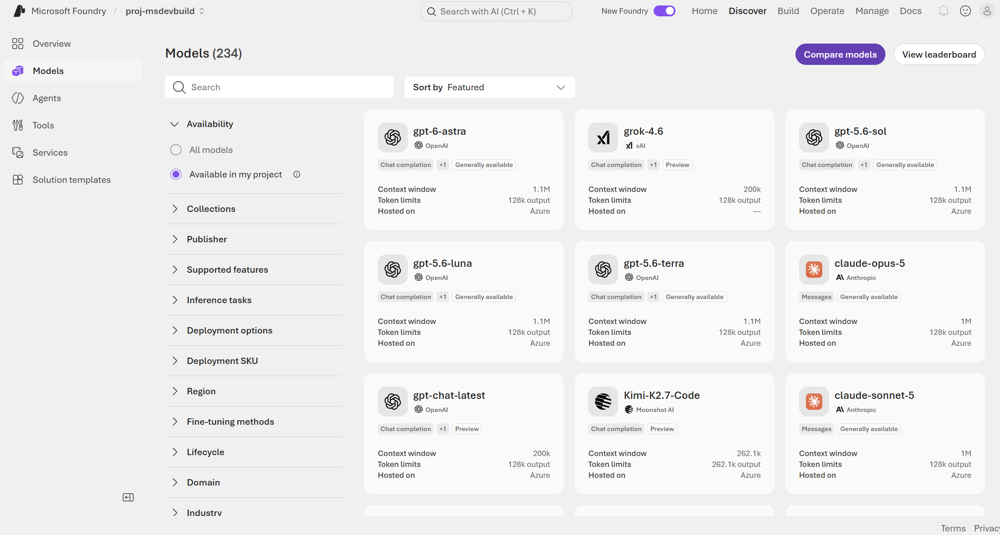
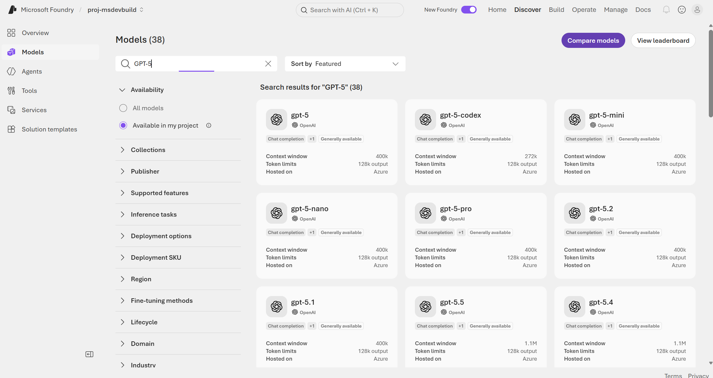
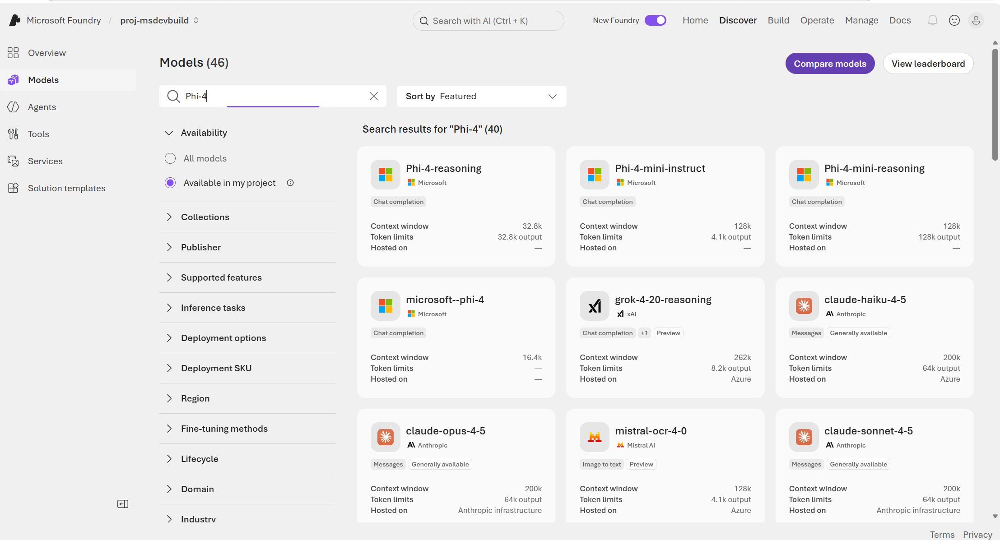

Open the Azure AI Foundry catalog for the first time and the reaction is usually the same: *there are how many models in here?* Well over a thousand, and the instinct is to grab the name you already recognize — GPT-5, probably — and wire it into everything. That instinct is exactly how projects end up slow, expensive, and still wrong for half the job. The newest, biggest model isn't "the best one." It's just one tool in a drawer full of them, and the real question is narrower than people think: not which model is best, but which one is right for *this* step of the pipeline.

## What types of models does Azure AI Foundry offer?

The catalog groups models by what they're built to do, not just by vendor:

| Type | Built for | Examples |
| --- | --- | --- |
| Large Language Models (LLMs) | Deep reasoning, complex generation, long context | GPT-5, Mistral Large, Llama 3 70B |
| Small Language Models (SLMs) | Fast, cheap, common NLP tasks; edge-capable | Phi-4, Mistral OSS, Llama 3 8B |
| Reasoning models | Multi-step problems: math, code, logistics | Claude Opus 4.6 |
| Embedding models | Text → vectors, for search and RAG | Ada, Cohere embeddings |
| Image generation | Text → image | GPT-image-1 |
| Video generation | Text → video | Sora 2 |
| Image analysis (multimodal) | Image + text → text | GPT-4.1 |
| Text to speech | Text → audio | GPT-4o-tts |
| Speech to text | Audio → text | GPT-4o-transcribe |

That's not a mock-up — it's a real Foundry project, filtered down to just **Available in my project**, and it's still sitting at 234 models. Scroll past the logos and every card is telling you the same three things: task type, context window, token limits. That's the actual filter you should be scanning for, not the brand name in bold at the top.

Nine rows in that table above, nine different jobs. The mistake almost everyone makes early on is lumping them together as "AI models" and picking whichever one they've heard of most.

## LLMs vs. SLMs: size is a cost decision, not a quality one

Bigger really does mean bigger here. An LLM like GPT-5 or Llama 3 70B carries more parameters and more training compute, and it shows the moment a task needs broad context or several layers of logic — summarizing a 40-page contract, drafting something genuinely original, holding a long conversation without losing the thread three turns in.

Type "GPT-5" into the search box and an entire family shows up — `gpt-5`, `gpt-5-mini`, `gpt-5-nano`, `gpt-5-pro`, `gpt-5.1` all the way through `gpt-5.5` — with context windows running from 272k up past 1.1M tokens. That's a lot of headroom, and headroom costs money on every single call.

Which is why it's worth saying plainly: an SLM like Phi-4 or Llama 3 8B is not a cut-rate LLM. It's a different tool built for a different job — smaller footprint, lower latency, cheaper per call, and in some cases small enough to run on a device with no internet connection at all. Point it at intent classification, short extraction, a simple rewrite, anything running at real volume, and it'll often match an LLM's accuracy for a fraction of the bill. The task never needed the extra reasoning depth in the first place.

Now search "Phi-4" and put the two screenshots side by side — the difference is sitting right there in the same three fields. 16.4k to 128k context, a sliver of what the GPT-5 family carries. That's the whole trade-off, visible in one screen: less raw context and reasoning power, traded for speed and a cost low enough that you can afford to run it on every single request without flinching.

So here's the rule of thumb worth actually remembering: **start with the smallest model that clears your accuracy bar, not the biggest one sitting at the top of the leaderboard.** Bumping a call from an SLM up to an LLM later is a one-line config change in Foundry — five minutes of work. Running everything through an LLM from day one, on the other hand, is a bill that's much harder to walk back once finance notices it.

## Chat completion vs. reasoning models

Most of what's in the catalog is a chat completion model — take the conversation so far, produce the next reasonable-sounding reply. That covers the vast majority of what an application actually does all day: support replies, content drafts, summaries, answering questions.

Reasoning models like Claude Opus 4.6 play a different game entirely. Instead of jumping straight to an answer, they work through the problem in steps and show that thinking before committing to a response. That's what makes them noticeably sharper at math, code that has to actually run, scientific analysis, logistics — and noticeably slower and pricier per call. There's no free lunch here.

Get this wrong in either direction and it shows. Send everything through a reasoning model and you're burning latency and budget on requests that never needed the depth. Send a genuinely gnarly multi-step problem — "replan this delivery schedule, the warehouse just closed" — through a plain chat model, and you get an answer that reads perfectly fluent and is quietly, confidently wrong. The fix isn't picking a side. It's a routing step: classify the request cheaply first, with an SLM, and only hand the hard ones off to the reasoning model.

## Specialized models: one job each, with real business use cases

Outside plain text, the catalog has single-purpose models that aren't competing with LLMs at all — they handle inputs and outputs a chat model simply can't touch. Worth saying bluntly: a RAG app without an embedding model isn't RAG. It's a chat model guessing at what your documents probably say, which is a nice way of describing a hallucination.

**Embedding models** (Ada, Cohere) turn text into vectors so you can search by meaning instead of exact wording. Picture an HR portal where someone types "how much unused leave do I have carried over from last year?" — nobody phrases policy questions the way the policy document does, and keyword search would come up empty. An embedding model indexes every policy doc and past Q&A thread, embeds the question the same way, and pulls back the nearest passages regardless of phrasing. That's the retrieval half of every RAG deployment you'll build: support knowledge bases, internal wikis, legal document search.

**Image generation** (GPT-image-1) goes from a text prompt straight to a picture. An e-commerce team staring down 200 seasonal banner variants — same product, new backgrounds, new color themes — for a campaign launching tomorrow morning doesn't have time to route each one through a design queue. A prompt template generates draft creative for every SKU overnight, and designers spend their morning polishing the handful that actually get used instead of starting from a blank canvas fifty times.

**Video generation** (Sora 2) does the same trick for motion. A SaaS company needing a 30-second explainer for a new feature, in every language it ships in, would normally be booking studio time per locale. Instead, a prompt describing the feature and the visual style produces a first-pass video for each one, and marketing trims and voices over from there — a multi-week production cycle collapsed into a same-day draft.

**Image analysis** (GPT-4.1) reads an image and text together and reasons over both. An insurance team fielding phone photos of dented bumpers doesn't want a human eyeballing every claim before triage. The model checks each photo against the claim description, flags damage that doesn't match the story, and drafts a structured severity estimate — turning an inbox of photos into a sorted queue instead of a backlog nobody wants to touch.

**Text to speech** (GPT-4o-tts) is where things stop being silent. A delivery app can read turn-by-turn pickup instructions to a driver hands-free, generated fresh from that order's address and notes rather than stitched together from a fixed phrase list — and the same pipeline doubles as accessible audio for order-status updates.

**Speech to text** (GPT-4o-transcribe) runs the other way. A call center transcribing support calls live can feed that transcript straight into the intent-classification SLM from earlier, so a supervisor dashboard flags an at-risk customer while the call is still happening — not two days later, buried in a post-call survey nobody filled out.

## Real-time use case: a retail support assistant

All of this stays abstract until you watch it happen inside one real build. Say you're the retailer: customers message in about orders, attach photos of what arrived broken, and argue refund cases that sometimes get messy. One project in Azure AI Foundry ends up calling five different models before a single reply goes out, each one earning its place:

1. **Intent routing — SLM (Phi-4).** Every incoming message is classified first: order status, return request, complaint, or "needs a human." Cheap, fast, high volume — this call happens on 100% of traffic, so it needs to be inexpensive.
2. **Order photo review — image analysis (GPT-4.1).** A customer uploads a photo of a damaged item. The model reads the image plus the customer's description and extracts structured detail: item, damage type, severity — text out, image and text in.
3. **Knowledge grounding — embedding model (Ada or Cohere).** The assistant needs answers grounded in the retailer's actual return policy and product catalog, not the model's general knowledge. An embedding model indexes that content; a vector search retrieves the relevant passages at query time.
4. **Response generation — LLM (GPT-5 or Mistral Large).** With the classified intent, the photo analysis, and the retrieved policy passages as context, the LLM drafts the actual reply to the customer — this is the step that needs broad language ability and long context, not the whole pipeline.
5. **Escalated disputes — reasoning model (Claude Opus 4.6).** A small fraction of cases are genuinely complex: conflicting order history, a policy exception, a multi-order refund calculation. These get routed to a reasoning model that can work through the logic step by step and produce a defensible recommendation for a human agent to approve.

Five models, one Foundry project, one consistent endpoint shape underneath all of it. The 95% of traffic that's routine never so much as touches the expensive reasoning model. The 5% that's genuinely hard never gets fobbed off with a shallow answer from a model that was never built to reason through it. Nobody overpays, and nobody gets a bad answer dressed up as a good one.

## How do you choose the right model in Azure AI Foundry?

Strip away the examples and it comes down to a handful of questions. Ask them in order, before you pick a model for a given step, and the answer tends to fall out on its own:

| Question | If yes → |
| --- | --- |
| Is this a high-volume, simple task (classify, extract, short rewrite)? | SLM |
| Does it need broad reasoning or long context, but not multi-step logic? | LLM, chat completion |
| Does it require breaking a problem into steps to get a correct answer? | Reasoning model |
| Does it need to search or match by meaning, not keywords? | Embedding model |
| Is the input or output an image, video, or audio rather than plain text? | The matching specialized model |
| Is the domain highly specialized (medical, legal, a specific language)? | Check for a domain-tuned model before defaulting to general-purpose |

## How does this show up on the AI-103 exam?

Model selection is a judgment call the **AI-103: Azure AI App and Agent Developer Associate** exam tests directly — not "what year did GPT-5 ship," but "given this scenario, which model type fits." Expect a short scenario followed by four options, exactly like the ones below.

**Sample question 1**

> A company is building a customer support agent in Azure AI Foundry. Before any other processing happens, every incoming ticket must be classified into one of five categories. The company expects several million tickets per month and needs the classification step to run at minimal latency and cost. Which model type should the company deploy for this step?
>
> A. A large language model (LLM) such as GPT-5
> B. A small language model (SLM) such as Phi-4
> C. A reasoning model such as Claude Opus 4.6
> D. An embedding model such as Ada

**Correct answer: B.** High-volume, single-label classification doesn't need an LLM's context window or a reasoning model's step-by-step logic — it needs the cheapest, fastest model that clears the accuracy bar, which is exactly the SLM case made [earlier in this article](#llms-vs-slms-size-is-a-cost-decision-not-a-quality-one).

**Sample question 2**

> A logistics company needs an agent that can replan delivery routes when a warehouse closes unexpectedly, accounting for driver hours, vehicle capacity, and delivery deadlines across dozens of stops. Which type of model is best suited to this task?
>
> A. A small language model (SLM)
> B. An embedding model
> C. A reasoning model
> D. A text-to-speech model

**Correct answer: C.** Multi-step constraint solving — the exam's usual language is "logistics," "scheduling," or "math requiring multiple steps" — is the textbook trigger for a reasoning model, not a chat completion model. Routing this through a plain LLM gets a fluent, confidently wrong plan.

**Sample question 3**

> A development team is implementing Retrieval Augmented Generation (RAG) so a chat agent can answer questions from the company's internal documentation. Which type of model is required to convert the documentation into a searchable index?
>
> A. A chat completion model
> B. An embedding model
> C. An image analysis model
> D. A reasoning model

**Correct answer: B.** RAG questions on this exam are really testing whether you know retrieval and generation are two different models. The embedding model builds and queries the vector index; a separate chat or reasoning model generates the final answer from what it retrieves.

The pattern across all three: the exam rarely asks you to name a model. It describes a constraint — volume, latency, multi-step logic, or a non-text input — and asks you to match it to a model *type*, which is exactly what the [decision framework above](#how-do-you-choose-the-right-model-in-azure-ai-foundry) is for.

## Key takeaways

- LLMs and SLMs are a cost and latency trade-off, not a quality tier — pick the smallest model that meets the accuracy bar for that specific step.
- Use chat completion models for the bulk of traffic; reserve reasoning models for tasks that genuinely need multi-step logic, and route to them with a cheap classification step first.
- Embedding, image, video, and speech models are not substitutes for a language model — they handle inputs and outputs a text model can't.
- A single Foundry project routinely calls multiple models across a pipeline; the catalog's consistent endpoint shape makes swapping one out a config change, not a rewrite.
- Check for a domain- or language-specific model before defaulting to a general-purpose one when the use case is specialized.
