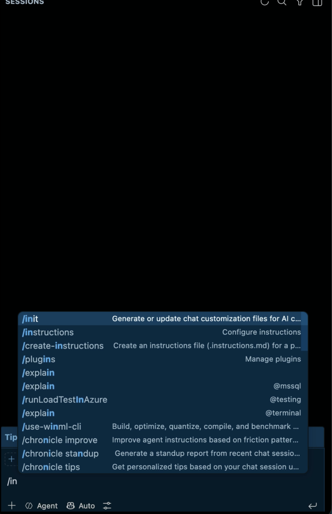
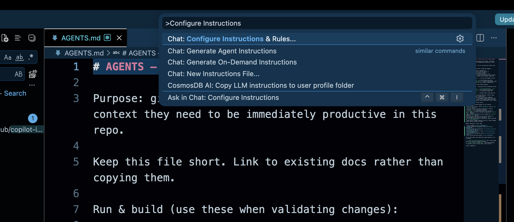

Two developers join the same project on the same day. Both clone the repo, both open VS Code, both start getting Copilot suggestions within a minute. By lunch, one of them has barely touched what Copilot wrote for him. The other has rewritten half of it — wrong HTTP client, wrong test framework, a folder structure Copilot invented that doesn't exist anywhere in the actual project.

Same Copilot. Same model version. The only real difference between the two of them is a file called `copilot-instructions.md` sitting in one repo and not the other.

## My own wake-up call with this

I ignored this file for a long time, longer than I'd like to admit. At one point I had three projects going at once — a Web API backend, a .NET MAUI app for one client, a Flutter app for another — and I was using Copilot the exact same way in all three. Open a controller in the Web API project, get suggestions that looked half-borrowed from the MAUI app. Wrong patterns, wrong assumptions about lifecycle. One time it suggested `StatefulWidget` boilerplate inside a C# file, because I'd had a Flutter tab open a few minutes before.

Copilot wasn't broken. I was giving it nothing to go on and expecting it to somehow keep four different codebases straight in its head. So one morning I sat down and wrote a proper `copilot-instructions.md` for each project — I basically just answered "what would I tell a new developer on their first day" for each one. The suggestions got noticeably better almost immediately. Not flawless. But close enough that I stopped fighting it constantly. That's the actual reason I'm writing this — it's a file that takes maybe five minutes and would've saved me weeks of low-grade annoyance if I'd bothered earlier.

## What is GitHub Copilot custom instructions?

It's a plain text file, `.github/copilot-instructions.md`, that tells Copilot how your project works before it writes anything. Rather than guessing your stack and conventions from whatever file happens to be open at that moment, Copilot reads this file automatically and carries it into every chat, every suggestion, every session — you don't have to remind it.

I've started thinking of it like the onboarding doc you'd hand a new hire on day one. Except this particular new hire actually reads the whole thing every single time, instead of skimming the first page and forgetting the rest by Friday.

## Why does it matter so much for your project?

Copilot has no idea what "normal" looks like on your team until you spell it out. It's seen millions of repos during training, every possible way to structure a project, name a variable, write a test — so left with no guidance, it just picks one. Not necessarily yours.

That mismatch doesn't show up as one big failure. It shows up as constant small friction: `fetch` when your team wraps everything in a custom HTTP client, Jest syntax when the project actually runs on Vitest. None of it is dramatic on its own. It's just a lot of tiny corrections, and it's usually the real reason behind the complaint "Copilot doesn't get our codebase" — when what actually happened is nobody ever told it.

<div style="margin: 32px 0;">
  <svg viewBox="0 0 900 320" xmlns="http://www.w3.org/2000/svg" role="img" aria-label="Animated comparison showing a Copilot suggestion being corrected without instructions versus matching immediately with instructions" style="width: 100%; height: auto; border-radius: 10px;">
    <title>Same prompt, two outcomes</title>
    <rect width="900" height="320" rx="10" fill="#1b2118" />
    <text x="225" y="34" text-anchor="middle" font-family="ui-monospace,monospace" font-size="13" fill="#c9614a">without copilot-instructions.md</text>
    <text x="675" y="34" text-anchor="middle" font-family="ui-monospace,monospace" font-size="13" fill="#8fbf92">with copilot-instructions.md</text>
    <line x1="450" y1="10" x2="450" y2="300" stroke="#2c3527" stroke-width="1" stroke-dasharray="5 5" />

    <rect x="40" y="55" width="370" height="230" rx="8" fill="#232a1f" stroke="#3c4536" />
    <text x="60" y="90" font-family="ui-monospace,monospace" font-size="14" fill="#8a9280">// user: add a request to fetch users</text>
    <text x="60" y="125" font-family="ui-monospace,monospace" font-size="15" fill="#c9614a" opacity="0">
      <animate attributeName="opacity" values="0;1;1;0.3;0" keyTimes="0;0.1;0.45;0.55;0.6" dur="5s" repeatCount="indefinite" />
      <tspan x="60" dy="0">fetch('/api/users')</tspan>
    </text>
    <text x="60" y="155" font-family="ui-monospace,monospace" font-size="12" fill="#c9614a" opacity="0">
      <animate attributeName="opacity" values="0;0;1;0.3;0" keyTimes="0;0.15;0.45;0.55;0.6" dur="5s" repeatCount="indefinite" />
      <tspan x="60" dy="0">✗ wrong client — no auth headers</tspan>
    </text>
    <text x="60" y="125" font-family="ui-monospace,monospace" font-size="15" fill="#8fbf92" opacity="0">
      <animate attributeName="opacity" values="0;0;0;0;1;1;0" keyTimes="0;0.55;0.6;0.65;0.75;0.95;1" dur="5s" repeatCount="indefinite" />
      <tspan x="60" dy="0">httpClient.get('/api/users')</tspan>
    </text>
    <text x="60" y="155" font-family="ui-monospace,monospace" font-size="12" fill="#8fbf92" opacity="0">
      <animate attributeName="opacity" values="0;0;0;0;0;1;0" keyTimes="0;0.6;0.65;0.7;0.8;0.95;1" dur="5s" repeatCount="indefinite" />
      <tspan x="60" dy="0">manually corrected — took a re-prompt</tspan>
    </text>

    <rect x="490" y="55" width="370" height="230" rx="8" fill="#232a1f" stroke="#5a7a5c" />
    <text x="510" y="90" font-family="ui-monospace,monospace" font-size="14" fill="#8a9280">// user: add a request to fetch users</text>
    <text x="510" y="125" font-family="ui-monospace,monospace" font-size="15" fill="#8fbf92" opacity="0">
      <animate attributeName="opacity" values="0;1;1;1;0.3;0" keyTimes="0;0.1;0.45;0.9;0.95;1" dur="5s" repeatCount="indefinite" />
      <tspan x="510" dy="0">httpClient.get('/api/users')</tspan>
    </text>
    <text x="510" y="155" font-family="ui-monospace,monospace" font-size="12" fill="#8fbf92" opacity="0">
      <animate attributeName="opacity" values="0;0;1;1;0.3;0" keyTimes="0;0.15;0.45;0.9;0.95;1" dur="5s" repeatCount="indefinite" />
      <tspan x="510" dy="0">✓ matches your wrapper — first try</tspan>
    </text>

    <text x="450" y="310" text-anchor="middle" font-family="ui-monospace,monospace" font-size="11" fill="#6b7461">same prompt, same model — only the instructions file differs</text>
  </svg>
</div>

## How do you actually create the file in VS Code?

Two ways to do it. I'd start with the first one even if you're planning to rewrite most of it by hand afterward.

**Letting Copilot draft it (this is the fast path):**

1. Open Copilot Chat inside VS Code
2. Type `/init` and send it
3. It scans your workspace — package files, folder layout, whatever config it can find — and drafts `.github/copilot-instructions.md` based on that
4. Sometimes it'll ask a question or two if something's genuinely ambiguous, like which test runner you're using if it spots two
5. Then go through the draft yourself. It's a first pass, not a finished file — cut the vague parts, add anything it can't infer on its own (like what's off-limits), and fix whatever it got wrong



**Writing it yourself:**

1. Command Palette (Ctrl+Shift+P, or Cmd+Shift+P on a Mac)
2. Run `Chat: Configure Instructions...` — older builds label this `Chat: Open Customizations`



3. VS Code creates the file and opens it for you
4. Fill it in using the categories further down this post

Once it exists, it's just always on — nothing to enable. If you edit it partway through a session, open a new chat afterward so the update actually takes effect.

## What actually goes into the file?

Roughly: whatever you'd tell a new developer during their first week, minus the small talk.

| Category | Example |
| --- | --- |
| Stack | "This is a .NET 8 Blazor Server app using Entra ID for auth." |
| Structure | "Components live in /Components, services in /Services." |
| Conventions | "Use PascalCase for public members, no underscores." |
| Testing | "Tests are xUnit, run with `dotnet test`, one test class per service." |
| Boundaries | "Never modify anything in /Migrations — that's Entity Framework's." |

I work across a few different stacks, so here are four real examples instead of one generic one.

### Example: C# Web API

```markdown
# Copilot instructions

This is an ASP.NET Core 8 Web API using minimal APIs, not controllers.

## Stack
- Minimal API endpoints in /Endpoints, grouped by feature
- EF Core with SQL Server, repositories in /Data
- Tests: xUnit + WebApplicationFactory for integration tests

## Conventions
- Return `Results.Problem()` for errors, never throw raw exceptions
- DTOs live in /Contracts, never expose EF entities directly
- Async all the way down — no `.Result` or `.Wait()`

## Off-limits
- Don't modify /Migrations
- Don't add new NuGet packages without asking first
```

### Example: .NET MAUI

```markdown
# Copilot instructions

This is a .NET MAUI app (Android + iOS) using MVVM with CommunityToolkit.Mvvm.

## Stack
- ViewModels use `[ObservableProperty]` and `[RelayCommand]`, not manual INotifyPropertyChanged
- Navigation via Shell, routes registered in AppShell.xaml.cs
- Tests: xUnit for ViewModels only, no UI tests yet

## Conventions
- Views (XAML) contain no business logic — everything goes through the ViewModel
- Platform-specific code stays in /Platforms, never in shared code
- Use `IDispatcher` for anything touching the UI thread from a background task

## Off-limits
- Don't touch /Platforms/iOS/Info.plist without asking
- Don't suggest Xamarin.Forms syntax — this is MAUI, not the old framework
```

### Example: Flutter

```markdown
# Copilot instructions

This is a Flutter app using Riverpod for state management, not Provider or Bloc.

## Stack
- State: Riverpod, providers live in /lib/providers
- Widgets: prefer StatelessWidget + Riverpod's ConsumerWidget over StatefulWidget
- Tests: flutter_test + mocktail for provider mocking

## Conventions
- No business logic inside widget build() methods — push it into providers
- Use named routes via go_router, defined in /lib/router
- Null-safety is mandatory — no `!` unless it's genuinely impossible to be null

## Off-limits
- Don't modify anything in /lib/generated
- Don't suggest setState() — this project doesn't use StatefulWidget for state
```

Three different stacks, same underlying idea: write down the facts Copilot would otherwise have to guess at, for the specific project it's sitting in right now.

## Do's and don'ts

| Do | Don't |
| --- | --- |
| Keep it under a page — specific and short beats thorough and vague | Write a full architecture document; it needs rules, not a wiki |
| State conventions as plain rules ("use async/await, not .Result") | Bury conventions inside paragraphs of prose |
| List what's off-limits — generated code, migrations, secrets | Assume it'll "just know" not to touch sensitive files |
| Update it the same week your conventions change | Let it sit for six months — a stale file actively misleads |
| Test it: start a fresh chat and ask it to describe your stack back to you | Write it once and never check whether it's actually following it |

## Common mistakes beginners make

The one I see most is a line like *"follow best practices and write clean code."* Sounds like guidance, isn't really any — "best practices" means something different in every language and every team, so it tells Copilot almost nothing concrete. It's the same as telling someone to "cook something good" instead of just handing them a recipe.

Second: treating this as a one-and-done task. Write it during week one of the project, never touch it again, and six months later it's still confidently pointing Copilot at a library you migrated off of back in March.

Third, scope creep — stuffing business context, project history, and roadmap notes into a file that's only supposed to answer one question: how do I write code that fits this repo. If it's not a coding convention, it probably belongs in a different doc entirely.

And the one that actually got me: assuming Copilot will somehow "just know" which project it's looking at when you're juggling more than one. It won't. A Flutter widget and a MAUI view can look close enough at a glance — both have some kind of widget tree, both have some flavor of state management — that without a file spelling out which is which, Copilot will happily mix patterns from one into the other. Every project gets its own file. Even the ones only you will ever open.

## Is this only for GitHub Copilot?

Not really, no — not anymore. The filename is Copilot's, but the concept has spread past it.

What actually surprised me while digging into this: VS Code's chat customization panel (`Chat: Open Customizations`) has an agent-type dropdown now, and Claude is one of the options sitting right next to local agents and Copilot CLI. VS Code can read `CLAUDE.md` directly too, through a setting called `chat.useClaudeMdFile`, and it understands `.claude/rules` files in Claude's own rules format. So Copilot isn't the only thing in VS Code paying attention to project instructions anymore — depending on what you've got enabled, Claude reads its own version of the same idea.

Then there's `AGENTS.md`, which I covered in an earlier post — built specifically to be tool-agnostic, read by Copilot, Claude, Codex, and others without any extra configuration on your end. If a repo has both a `copilot-instructions.md` and an `AGENTS.md`, your personal user-level instructions still win over both, but the two repo-level files can sit there together without stepping on each other.

How I'd actually decide which to set up:

| Your situation | What to set up |
| --- | --- |
| Only using Copilot | `.github/copilot-instructions.md` is enough |
| Using Copilot and Claude inside VS Code | Turn on `chat.useClaudeMdFile` and keep both, or just consolidate into `AGENTS.md` |
| Team mixes Copilot, Cursor, Claude Code, whatever else | `AGENTS.md` at the root — one file, everything reads it |

## How this compares across AI coding tools

If you've touched more than one AI assistant, you've already run into some version of this file — everyone landed on roughly the same idea, just under a different filename.

| Tool | Instructions file |
| --- | --- |
| GitHub Copilot | `.github/copilot-instructions.md` |
| Cursor | `.cursorrules` (or `.cursor/rules/`) |
| Claude Code / Claude Projects | `CLAUDE.md` or project-level instructions |
| Tool-agnostic standard | `AGENTS.md`, increasingly read by multiple tools including Copilot |

The underlying idea doesn't change from tool to tool — hand the model your project's context once, in a file, instead of typing it out in every prompt. Copilot-only setup, `copilot-instructions.md` covers it. Mixed toolchain, `AGENTS.md` is worth the extra ten minutes.

## Key takeaways

- Custom instructions are one file — `.github/copilot-instructions.md` — read automatically before every suggestion
- Without it, Copilot guesses your stack and conventions fresh, every single time
- Type `/init` in Copilot Chat for a fast first draft, then edit it by hand
- Keep it short, specific, and written as rules, not prose — one file per project, even if you juggle several
- It's not locked to Copilot forever: VS Code can read CLAUDE.md for the Claude agent too, and AGENTS.md works across tools entirely
- It's the first thing anyone learning Copilot should set up, before agents, hooks, or anything more advanced
