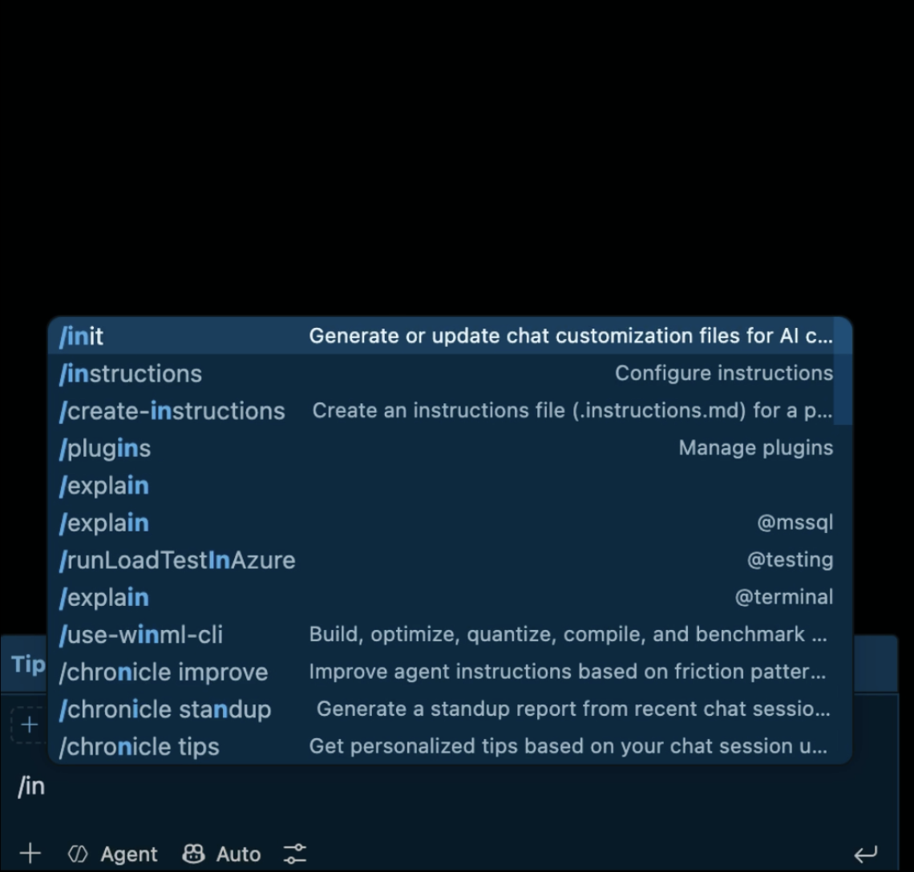

AI coding agents now write a big share of the code we ship. GitHub, Anthropic, and OpenAI have all shared numbers that point the same way.

But there's a part nobody talks about enough. What happens when more than one person writes code with an agent? Or even one person, working across many sessions, with nothing tying those sessions together?

Here's the short answer: **an agent will not stay consistent with itself unless you tell it how.** This is true whether you're a team of ten or one person working across a few weekends. AGENTS.md is the fix. It works just as well on a small hobby project as it does on a codebase with hundreds of contributors.

## The same problem, at every scale

**Solo developer.** In January, you ask your agent to build a login screen. It picks one way to manage state, one folder structure, one style of error handling. In April, you work on a new feature in the *same* project and ask again — and you get a different answer. The agent didn't get worse. Nothing carried your January decision forward. Now you're digging through your own project, trying to figure out which pattern is the "real" one.

**Small team (3 to 10 developers).** Here the problem shows up fast. One person's agent reaches for Redux. Another's reaches for Context. A third pulls in a state library nobody else has used. Three reasonable choices for the same problem. Duplicate API clients start showing up, because no agent can see what already exists two folders away. In code review, none of it looks like a bug. It looks like three people who never talked to each other — which, in a way, is exactly what happened.

**Enterprise (dozens to hundreds of developers).** Same as the small-team case, but it keeps growing instead of staying small. Different squads may not even know they picked different conventions — until a shared feature forces two patterns to meet. Onboarding gets harder, not easier. A new hire isn't learning one set of rules. They're trying to guess which of several competing ones is actually the current one.

The root cause is the same at every size: an AI agent makes a reasonable local decision with **zero view of what already happened elsewhere** — whether "elsewhere" is another developer's session, or your own, three months ago.

## What AGENTS.md actually fixes

It's one file. The agent reads it automatically before it writes anything. It tells the agent the architecture, the one approved way to handle state and data, where things belong, and what already exists so it doesn't rebuild it.

It doesn't matter if you write Dart, TypeScript, C#, or Python. It doesn't matter if you're a team of one or two hundred. The fix is the same because the problem is the same.

Think of it like this. There's a big difference between handing someone repo access and saying "go," and actually walking them through how the project is built. An AI agent needs that walkthrough *every session*, because it doesn't remember yesterday's conversation on its own. AGENTS.md is that walkthrough — written once, read automatically every time after.

## How is this different from copilot-instructions.md?

If you read the earlier post on custom instructions, you already know `.github/copilot-instructions.md`. So it's fair to ask why we need a second file that seems to do the same job.

Short answer: they overlap in purpose, but differ in scope and in who reads them.

| | `.github/copilot-instructions.md` | `AGENTS.md` |
| --- | --- | --- |
| Who reads it | GitHub Copilot only | Codex, Cursor, Copilot, Windsurf, Aider, and more — natively |
| Where it lives | Fixed path, repo root only | Root, plus optional nested files per subfolder/monorepo package |
| Origin | GitHub/Copilot-specific convention | Open, vendor-neutral standard |
| Claude Code | Not applicable — Copilot-only anyway | Needs a symlink or `@AGENTS.md` import; doesn't read it natively either |
| Best fit | Copilot-only, no plans to mix tools | Using, or might use, more than one AI coding tool |

If everyone on your team uses Copilot and plans to stay there, `copilot-instructions.md` is simpler and does the job.

But the moment a second tool shows up — someone tries Cursor, someone tests Claude Code — AGENTS.md stops being the "extra" file. It becomes the file that saves you from maintaining two or three near-identical instruction files that slowly drift apart.

You can run both at the same time with no conflict. Copilot reads its own file. Other tools read the standard one. The only real cost is remembering to update both when a shared rule changes.

## A generic example, not tied to any framework

Here's roughly what a small one looks like, stripped down to the shape that works for any stack or team size:

```markdown
# AGENTS.md

## Project
Web app, React frontend, Node/Express backend, PostgreSQL. Monorepo.

## Architecture
Feature-based folders, not type-based. Each feature owns its components,
hooks, and API calls — don't split a feature across /components and /hooks
at the top level.

## State management
Use the existing Zustand store in /src/store. Don't introduce Redux,
Context-based state, or a second store.

## API layer
All requests go through /src/api/client.ts. Don't call fetch() directly
in components, and don't create a second HTTP client.

## Error handling
API errors return a Result<T, Error> type, never throw across the
API boundary. Log unexpected errors through /src/lib/logger.ts.

## Testing
Vitest for units, Playwright for e2e. New features need at least one
unit test per new function in /src/api or /src/store.

## Off-limits
- Don't modify /prisma/migrations
- Don't add new npm dependencies without flagging it in the PR description
```

Swap the details and the same shape works for a Django backend, a Spring Boot service, a Flutter app, an Angular frontend — anything, solo or shared. The sections stay the same: stack, architecture, the one approved pattern for state and data, error handling, testing, and what's off-limits.

If you want to see the Flutter version of exactly this file, the [`AGENTS.md` in my food delivery app](https://github.com/jssuthahar/food-delivery-app/blob/main/AGENTS.md) is committed and readable — same six sections, filled in for a Clean Architecture Flutter app with BLoC. The [app itself runs in the browser](https://jssuthahar.github.io/food-delivery-app/) if you want to see what the rules produced before you read them.

## How do you actually create the file?

The simplest version costs nothing. Create a file named `AGENTS.md` at the root of your repo. Plain text. No special tools. That's the whole setup. Any tool that reads it will pick it up from that spot automatically.

If you use VS Code with Copilot, there's a faster way. Open Copilot Chat and type `/init`.



It scans the repo and writes a first draft based on what it finds — dependencies, folder structure, whatever config already exists. Treat the output as a draft, not a finished file. It's good at spotting patterns that are already consistent in your code. But it can't tell you which pattern to pick if your codebase already has two or three competing ones. That call is still yours — on a solo project as much as a team one.

For a monorepo, or a project with very different sub-projects, add more `AGENTS.md` files inside subfolders. The file closest to the code being edited wins over the root one. Keep shared rules in the root file, and put sub-project details in the nested ones.


## Is this only for GitHub Copilot?

No. And that's the whole reason AGENTS.md exists as its own thing, separate from `copilot-instructions.md`.

It's an open, vendor-neutral standard. A long list of tools read it natively: OpenAI Codex, Cursor, GitHub Copilot, Windsurf, Aider, Cline, Continue, Goose, Zed, and more. No per-tool setup. No config. The file just gets picked up, because everyone agreed on the same filename and location.

There's one important exception, and it's easy to get wrong: **Claude Code does not read AGENTS.md natively.** It uses its own file, `CLAUDE.md`. As of the latest Claude Code release at the time of writing, Anthropic hasn't added native AGENTS.md support. There's a long-running GitHub issue with thousands of upvotes asking for it, with no promised date.

The workaround, documented by Anthropic themselves, is one of these two:

```bash
# Option 1: symlink, Claude Code reads AGENTS.md through CLAUDE.md
ln -s AGENTS.md CLAUDE.md
```

```markdown
# Option 2: import syntax inside CLAUDE.md
@AGENTS.md
```

Either way, you keep one main file, and Claude Code reads the same rules through the redirect. This area moves fast, so check the current docs before you commit to either workaround — native support could land at any time.

## So how much workload does this actually save?

There's no controlled study behind this. Anyone who gives you a confident savings number is guessing, same as everyone else. What's more useful is knowing *where* the savings show up:

- **Code review time drops the most.** When every session writes code against the same architecture, reviewers stop asking "why is this different from everywhere else" and start reviewing the actual logic. That architectural-mismatch comment is usually the first thing to shrink.

- **Rework drops next.** Fewer features get built on the wrong pattern in the first place, so fewer need a partial rebuild later. This one is harder to measure, because it depends on how much drift already existed. A project six months into inconsistency has far more to clean up than one that catches it early.

- **Ramp-up time drops, but it takes longer to notice.** New hire or not — even you, coming back to an old side project — reading one file beats reverse-engineering several competing patterns. Real effect, slow to measure, because there's no clean baseline to compare against.

If you want an honest range instead of a fake exact number: **expect 20–40% less time lost to inconsistency-driven rework and review friction.** The lower end is for smaller projects that catch this early. The higher end is for larger ones that let drift run for months. Treat it as an estimate from watching patterns, not a benchmark you can cite.

## Key takeaways

- This isn't a framework problem or a team-size problem. It happens any time an AI agent writes code without shared context — solo or at enterprise scale.
- Solo, the drift shows up as inconsistency with your own earlier decisions. On a team, it shows up as competing "correct" versions of the same thing.
- AGENTS.md fixes it by giving every session the same architectural context before it writes anything.
- It's genuinely open and tool-agnostic — read natively by Codex, Cursor, Copilot, Windsurf, Aider, and more — with one exception: Claude Code needs a symlink or import to read the same file.
- It stops *new* drift. It doesn't fix code that's already inconsistent — budget separate time for that.
- Workload savings are real but hard to measure precisely. Expect the biggest win in code review time, with rework and ramp-up improving more slowly.
- Next: [the complete playbook](/blog/agents-md-complete-playbook) goes section by section through what belongs in the file, and [Copilot custom instructions](/blog/github-copilot-custom-instructions) covers the smaller Copilot-only version of the same idea.
