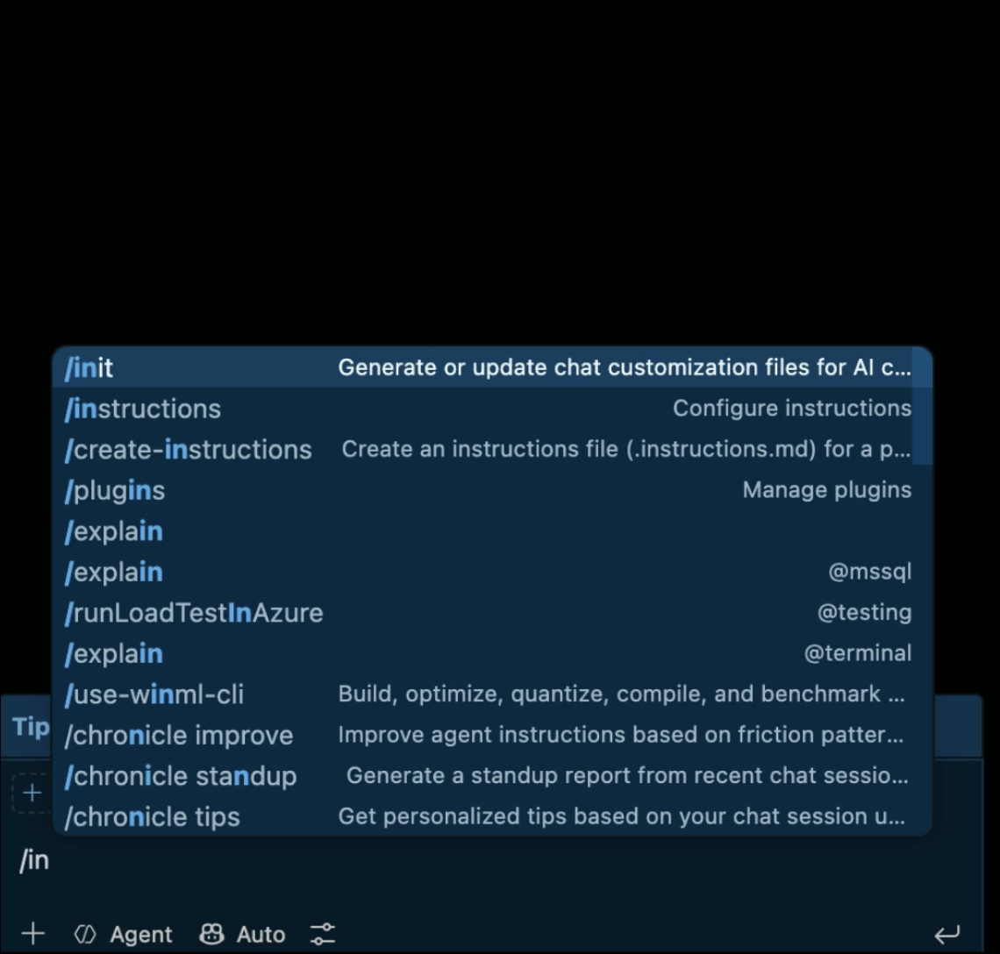
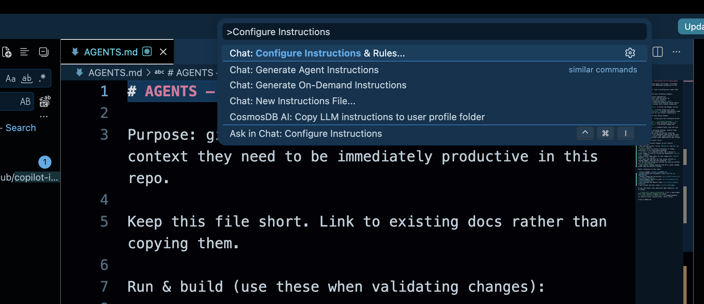

import Callout from '../../../../components/mdx/Callout.astro';
import ShortHighlight from '../../../../components/ShortHighlight.astro';

GitHub Copilot custom instructions are one file, `.github/copilot-instructions.md`, that Copilot reads before every suggestion it makes in your repository. Without it, Copilot guesses your stack and conventions from whatever file is open. This is what that guess costs on a real Flutter app, and how to write the file that stops it.

Picture two developers joining the MSDevBuild Eats team on the same Monday. Both clone the repo, both open VS Code, both get Copilot suggestions within a minute. By Wednesday, one of them has barely touched what Copilot wrote. The other has rewritten half of it: the wrong state management, error handling in the wrong layer, an import the architecture forbids.

Same Copilot. Same model. The only difference is that one of them was working in a clone where `.github/copilot-instructions.md` had been deleted.

<Callout type="tip" title="Follow along in a real app, not a snippet">
Everything below is written against **MSDevBuild Eats**, the open-source Flutter food delivery app used across this blog: customer, restaurant partner and rider in one codebase, Clean Architecture, BLoC, 40-odd use cases. It runs with no API keys and no Firebase project, so you can clone it and have Copilot working inside it in about two minutes.

- **Source code**: [github.com/jssuthahar/food-delivery-app](https://github.com/jssuthahar/food-delivery-app)
- **Live web**: [jssuthahar.github.io/food-delivery-app](https://jssuthahar.github.io/food-delivery-app/) (sign in with `customer@msdevbuild.com` / `demo1234`)
- **Android build**: [download and install](https://appdistribution.firebase.dev/i/00432c5aa60de58b) through Firebase App Distribution

The instructions file discussed here is the one actually committed at [`.github/copilot-instructions.md`](https://github.com/jssuthahar/food-delivery-app/blob/main/.github/copilot-instructions.md).
</Callout>

## One week, and the corrections nobody counted

The scenario is a first task for the new developer without the file: add loyalty points to the cart and show them in the price breakdown.

| Day | What happened |
| --- | --- |
| Mon 10:00 | Clone, `flutter pub get`, Copilot Chat open. The first screen it scaffolds is a `StatefulWidget` with `setState` |
| Mon 15:00 | The loyalty calculation lands in the widget, next to the button that displays it |
| Tue 11:00 | The repository call is wrapped in a `try/catch` inside `CartBloc` |
| Tue 16:00 | A helper imports a data source straight into `lib/features/cart/` |
| Wed 10:00 | The pull request goes up. **14 review comments** |
| Wed 14:00 | Rework. The reviewer repeats three of the same comments on the fixes |
| Thu 17:00 | Merged, on the third review round |

None of those suggestions was wrong Flutter. Each one is a pattern Copilot has seen thousands of times. It was wrong for *this* repository, and nothing in the repository said so where Copilot could read it.

I had my own version of this week, long before this app existed. I had a Web API backend, a .NET MAUI app and a Flutter app open in the same month, and I used Copilot the same way in all three. Open a controller in the Web API and get suggestions that looked half-borrowed from the MAUI app. Once it suggested `StatefulWidget` boilerplate inside a C# file, because a Flutter tab had been open a few minutes earlier. Copilot was not broken. I was giving it nothing to go on. Nothing at all.

## The command that counted the damage

On Wednesday the tech lead reads the fourteen comments and asks a fair question: how many of these are about the feature, and how many are about how this app is built? The diff answers it:

```bash
# Added lines only, in the pull request, that break the three rules the app lives by
git diff main...feature/loyalty-points -- lib/ | grep '^+' | grep -cE 'setState\('
git diff main...feature/loyalty-points -- lib/ | grep '^+' | grep -cE '\} catch \('
git diff main...feature/loyalty-points -- lib/features/ | grep '^+' | grep -cE "import '.*/data/"
```

| Rule broken | Added lines |
| --- | --- |
| `setState` instead of a BLoC event | 6 |
| `try/catch` in a bloc instead of `Result<T>` | 3 |
| A feature importing from `lib/data/` | 2 |

Eleven lines. Eleven of the fourteen review comments. The other three were about the feature itself. The review spent most of its time teaching the architecture, one comment at a time, to a developer who would learn it, and to a tool that would forget it by the next chat.

<figure>

![Two step flows side by side for the same request, add loyalty points to the cart. On the left, without copilot-instructions.md: step 1, Copilot reads the open file and whatever it saw in training; step 2, it picks the common Flutter pattern, a StatefulWidget with setState; step 3, error handling where it is typed, a try/catch inside the bloc; step 4, data reached from the UI, an import from lib/data. The red outcome: 11 of 14 review comments are conventions. On the right, with copilot-instructions.md, the same request in a new chat: step 1, Copilot reads the file first; step 2, it knows the state rule, a CartEvent and not setState; step 3, it knows the error contract, Result and no throw across the boundary; step 4, it knows where rules live, points priced on the Cart entity. The green outcome: approved on the first review.](./images/copilot-custom-instructions-before-after-pull-request.png)

<figcaption>Figure 1 — the same request, twice. Only the first box differs, and everything after it follows from that.</figcaption>

</figure>

## What is GitHub Copilot custom instructions?

It is a plain Markdown file, `.github/copilot-instructions.md`, that tells Copilot how your project works before it writes anything. Rather than guessing your stack from whatever file is open, Copilot adds this file to every chat request in the repository automatically. You never have to paste it or remind it.

Think of it as the onboarding document you would hand a new developer on day one, except this reader actually reads the whole thing every single time, instead of skimming the first page and forgetting the rest by Friday.

## Why does it matter so much for your project?

Copilot has no idea what "normal" looks like on your team until you write it down. It has seen millions of repositories, and every way to structure a project, name a variable or write a test. Left with no guidance, it picks the most common one. Not necessarily yours.

That mismatch rarely shows up as one big failure. It shows up as constant small friction: `fetch` when your team wraps every call in its own HTTP client, Jest syntax when the project runs on Vitest, `setState` in an app built on BLoC. None of it is dramatic on its own. Together it is the real reason behind "Copilot doesn't get our codebase". Nobody ever told it.

If you would rather see the idea first, the loyalty-points week is a short video, and so is why Copilot needs telling at all:

<ShortHighlight slugs={['copilot-instructions-eleven-of-fourteen', 'copilot-context-window']} />

## Creating the file in VS Code

Two ways to do it. Start with the first one even if you plan to rewrite most of it by hand.

**Letting Copilot draft it, the fast path:**

1. Open Copilot Chat inside VS Code
2. Type `/init` and send it
3. It scans your workspace, package files, folder layout and whatever config it finds, and drafts `.github/copilot-instructions.md`
4. It may ask a question if something is genuinely ambiguous, like which test runner you use if it spots two
5. Then read the draft yourself. It is a first pass: cut the vague parts, add what it cannot infer, like what is off-limits, and fix what it got wrong



**Writing it yourself:**

1. Open the Command Palette: Ctrl+Shift+P, or Cmd+Shift+P on a Mac
2. Run `Chat: Configure Instructions...`; older builds label this `Chat: Open Customizations`



3. VS Code creates the file and opens it
4. Fill it in using the categories below

Once it exists, it is always on. Nothing to enable. If you edit it partway through a session, open a new chat so the update takes effect.

<figure>


<figcaption>Figure 2 — where the file sits in the loop. It is read before the suggestion, not after.</figcaption>

</figure>

## What actually goes into the file

Whatever you would tell a new developer in their first week, minus the small talk.

| Category | Example |
| --- | --- |
| Stack | "This is a .NET 8 Blazor Server app using Entra ID for auth." |
| Structure | "Components live in /Components, services in /Services." |
| Conventions | "Use PascalCase for public members, no underscores." |
| Testing | "Tests are xUnit, run with `dotnet test`, one test class per service." |
| Boundaries | "Never modify anything in /Migrations; that is Entity Framework's." |

Here are three real examples across three stacks. The first is from the food delivery app, and you can open the repo alongside it to check every rule.

### Example: the Flutter food delivery app

Each rule in this file exists for a reason you can go and verify in the repo.

```markdown
# Copilot instructions

MSDevBuild Eats — a Flutter food delivery app (customer, restaurant partner and
delivery rider in one codebase) running on web, Android, iOS and tablet.

## Stack

- Flutter, Dart SDK `>=3.5.0 <4.0.0`
- State: BLoC / Cubit (flutter_bloc), with bloc_concurrency for event
  transformers. Not Riverpod, not Provider, not setState
- DI: get_it, one graph in lib/app/di/service_locator.dart
- Navigation: go_router, routes in lib/app/router/
- Tests: flutter_test + bloc_test + mocktail

## Architecture

Clean Architecture, three layers, dependencies point inward only.

- lib/domain/ — entities, repository interfaces, use cases. Pure Dart.
  Never import package:flutter/*, Firebase or shared_preferences here
- lib/data/ — models with JSON mapping, data sources, repository
  implementations of the domain interfaces
- lib/features/<feature>/ — presentation. Each feature owns bloc/ and
  presentation/widgets/. Never import from lib/data/
- lib/core/ — shared and feature-agnostic

## Conventions

- Repositories and use cases return Result<T> — never throw across the
  repository boundary
- Data sources throw AppException; repositories translate to a domain Failure
  through mapErrorToFailure, and nowhere else
- Orchestration lives in use cases, not in blocs
- Blocs are not registered in get_it. Only AuthBloc, CartBloc and ThemeCubit
  are hoisted to the app root
- Entities are immutable, Equatable, and carry their own rules
- Lints: single quotes, const constructors, declared return types, no print

## Off-limits

- Don't edit lib/firebase_options.dart by hand — flutterfire generates it
- Don't add a package to pubspec.yaml without asking first
- Don't touch build/, .dart_tool/ or any *.g.dart file
```

Three of those lines carry most of the weight:

**"Not Riverpod, not Provider, not setState."** Flutter has four popular ways to hold state, and Copilot has seen all of them. Without this line, a request for a new screen often comes back as a `StatefulWidget` with `setState`, which contradicts how every other screen in the app works. Naming what you *don't* use matters more in Flutter than in any other stack I write in.

**"Return `Result<T>`, never throw across the repository boundary."** The app's whole error contract depends on it. Data sources throw, repositories catch once in `mapErrorToFailure`, and everything above gets `Success<T>` or `FailureResult<T>` in the type signature. Copilot's default instinct is a `try/catch` in the bloc, which quietly spreads error handling across three layers instead of one.

**"Blocs are not registered in get_it."** Nobody can infer this from one file. `get_it` is in the dependency list, blocs are in every feature folder, and the obvious conclusion is wrong. It is exactly what you would say out loud to a new developer in their first week and then never think about again.

### Example: C# Web API

This one matches the feature-folder layout from [structuring a .NET Minimal API project](/blog/minimal-api-project-structure); if your API follows that layout, the Structure lines are already written for you.

```markdown
# Copilot instructions

This is an ASP.NET Core 8 Web API using minimal APIs, not controllers.

## Stack
- Minimal API endpoints in /Endpoints, grouped by feature
- EF Core with SQL Server, repositories in /Data
- Tests: xUnit + WebApplicationFactory for integration tests

## Conventions
- Return `Results.Problem()` for errors, never throw raw exceptions
- DTOs live in /Contracts, never expose EF entities directly
- Async all the way down — no `.Result` or `.Wait()`

## Off-limits
- Don't modify /Migrations
- Don't add new NuGet packages without asking first
```

### Example: .NET MAUI

```markdown
# Copilot instructions

This is a .NET MAUI app (Android + iOS) using MVVM with CommunityToolkit.Mvvm.

## Stack
- ViewModels use `[ObservableProperty]` and `[RelayCommand]`, not manual INotifyPropertyChanged
- Navigation via Shell, routes registered in AppShell.xaml.cs
- Tests: xUnit for ViewModels only, no UI tests yet

## Conventions
- Views (XAML) contain no business logic — everything goes through the ViewModel
- Platform-specific code stays in /Platforms, never in shared code
- Use `IDispatcher` for anything touching the UI thread from a background task

## Off-limits
- Don't touch /Platforms/iOS/Info.plist without asking
- Don't suggest Xamarin.Forms syntax — this is MAUI, not the old framework
```

Three stacks, one idea: write down the facts Copilot would otherwise guess at, for the project it is sitting in right now.

## Trying this on a real project

Reading an instructions file teaches you its shape. Watching Copilot change its answer because of one teaches you why it is worth writing. Twenty minutes, no accounts, no keys:

```bash
git clone https://github.com/jssuthahar/food-delivery-app
cd food-delivery-app
flutter pub get
flutter run -d chrome
```

Sign in as `customer@msdevbuild.com` / `demo1234`. There is no server behind it: a seeded in-memory backend with 20 restaurants and 100 dishes stands in, and it walks your order from confirmed to delivered on a timer.

Then run the comparison:

1. **Delete the instructions file first**: `rm .github/copilot-instructions.md`. You want the default behaviour before the corrected one.
2. **Open a fresh Copilot Chat** and ask: *"add a loyalty points field to the cart and show it in the price breakdown."*
3. **Read what comes back.** In my run it reached for `setState` inside the cart widget, computed the points in the UI layer, and wrapped the repository call in a `try/catch`. Three violations of how the app is built, none of them obviously wrong if you had never seen the codebase.
4. **Restore the file** with `git checkout .github/copilot-instructions.md`, open a *new* chat, and ask the exact same question.
5. **Read it again.** Now it adds a `CartEvent`, puts the calculation on the `Cart` entity next to the rest of the pricing, and returns `Result<T>` instead of throwing.

Same question, same model, same repo. The only variable is whether Copilot knew where it was.

Two more things worth doing while the repo is open:

- **Try the [live web build](https://jssuthahar.github.io/food-delivery-app/)** and place an order, then find the code that ran it. The order status timeline is `OrderStatus` in `lib/domain/entities/`, a state machine that the customer timeline, the partner's "advance order" button and the rider's job card all read from.
- **[Install the Android build](https://appdistribution.firebase.dev/i/00432c5aa60de58b)** and put it next to the web tab. Identical Dart, one responsive layer. "Never import from `lib/data/`" is what lets one codebase serve both without a fork.

## When one file is not enough

Use custom instructions for anything Copilot would otherwise guess: the stack, the boundaries, the conventions, the off-limits list. Stop relying on them alone in four situations.

**When a rule must never be broken.** Instructions guide; they do not enforce. The food delivery app is proof: its file says features never import from `lib/data/`, and yet three older screens in `lib/features/` still do. Nothing stopped them. A rule that must hold goes into a lint or an architecture test as well, where a build fails instead of a review comment being written.

**When a rule only applies to part of the code.** Add path-specific files under `.github/instructions/`, named something like `bloc.instructions.md`, with an `applyTo` glob in the front matter. Copilot adds them only when it is working on matching files, so the main file stays short.

**When the codebase is old and the rules are unwritten.** On a legacy system nobody can write the file from memory. Let an agent read the code first and draft the rules from what it finds, the approach in [GitHub Copilot agents for legacy applications](/blog/github-copilot-agents-for-legacy-applications), then edit that draft like any other.

**When the file starts to grow.** Every line is sent with every request. A one-page file is cheap; a ten-page file is a tax on every question, and the rules that matter get lost among the ones that do not.

<Callout type="mistake" title='"Follow good practice and write clean code"'>
The most common first line in an instructions file, and the least useful. "Clean" means something different in every language and every team, so it tells Copilot nothing it can act on. It is like telling someone to "cook something good" instead of handing them the recipe. Write the rule itself: "Return `Result<T>`, never throw across the repository boundary."
</Callout>

## How efficient is it?

The file costs a fixed amount on every request, and saves a correction every time one of its rules would otherwise have been broken. For this app, the numbers look like this.

The cost side:

| | Size |
| --- | --- |
| The file | 75 lines, 3,575 characters |
| Added to each chat request | roughly 900 tokens |
| Your time to write it | an hour, with `/init` doing the first draft |

The saving side, for the loyalty points task in this scenario:

| | Without the file | With the file |
| --- | --- | --- |
| Copilot suggestions kept as written | 3 of 9 | 8 of 9 |
| Lines breaking a house rule | 11 | 0 |
| Review comments about conventions | 11 of 14 | 0 of 3 |
| Review rounds | 3 | 1 |
| Time to merge | Monday to Thursday | the same day |

The rule underneath: **the cost is paid per request, the saving is paid per rule break avoided**. A 900-token file that stops one `setState` rewrite has paid for itself many times over. A file padded with prose nobody needed pays the same cost and saves nothing extra.

## Do's and don'ts

| Do | Don't |
| --- | --- |
| Keep it under a page: specific and short beats thorough and vague | Write a full architecture document; it needs rules, not a wiki |
| State conventions as plain rules ("use async/await, not .Result") | Bury conventions inside paragraphs of prose |
| List what is off-limits: generated code, migrations, secrets | Assume it will "just know" not to touch sensitive files |
| Update it the same week your conventions change | Let it sit for six months; a stale file actively misleads |
| Test it: start a fresh chat and ask it to describe your stack back to you | Write it once and never check whether Copilot follows it |

## Common mistakes beginners make

The first is treating it as a one-off task. Write it in week one, never touch it again, and six months later it is still confidently pointing Copilot at a library you migrated off in March.

The second is scope creep: stuffing business context, project history and roadmap notes into a file that should answer one question, how do I write code that fits this repo. If it is not a coding convention, it belongs in a different document.

The third is the one that caught me: assuming Copilot will "just know" which project it is in when you work on more than one. A Flutter widget and a MAUI view look close enough, both with some kind of view tree and some flavour of state management, that without a file saying which is which, Copilot mixes patterns from one into the other. Every project gets its own file, even the ones only you will ever open.

## Whether this is only for GitHub Copilot

Not anymore. The filename is Copilot's, but the idea has spread past it.

VS Code's chat customization panel has an agent-type dropdown now, and Claude is one of the options next to local agents and Copilot CLI. VS Code can read `CLAUDE.md` directly through a setting called `chat.useClaudeMdFile`, and it understands `.claude/rules` files too. So depending on what you have enabled, more than one assistant in the same editor is looking for project instructions.

There is also `AGENTS.md`, a tool-agnostic file at the repository root that Copilot, Claude, Codex and other agents read without extra configuration. If a repository has both `copilot-instructions.md` and `AGENTS.md`, your personal user-level instructions still take priority over both, and the two repository files sit side by side without conflict.

| Your situation | What to set up |
| --- | --- |
| Only using Copilot | `.github/copilot-instructions.md` is enough |
| Using Copilot and Claude inside VS Code | Turn on `chat.useClaudeMdFile` and keep both, or consolidate into `AGENTS.md` |
| Team mixes Copilot, Cursor, Claude Code and others | `AGENTS.md` at the root: one file, every tool reads it |

## How this compares across AI coding tools

Every assistant landed on roughly the same idea, under a different filename:

| Tool | Instructions file |
| --- | --- |
| GitHub Copilot | `.github/copilot-instructions.md` |
| Cursor | `.cursorrules` (or `.cursor/rules/`) |
| Claude Code and Claude Projects | `CLAUDE.md` or project-level instructions |
| Tool-agnostic standard | `AGENTS.md`, read by several tools including Copilot |

The idea does not change from tool to tool: hand the model your project's context once, in a file, instead of typing it into every prompt.

## Questions a tech lead will ask about this

1. **"Why not just review harder?"** Review catches the break after it is written, once per pull request. The file prevents it before it is written, once per request, for free after the first hour.
2. **"Who owns the file?"** The same people who own the architecture. Changes to it go through review like code, because a wrong rule is followed as faithfully as a right one.
3. **"Will it stop Copilot breaking our boundaries?"** It makes breaks rarer. It does not make them impossible. Anything that must never happen also needs a lint or a test.
4. **"How do we know it works?"** Ask Copilot in a fresh chat to describe your stack and rules. Then run the same prompt with and without the file, as in the comparison above.
5. **"One file or several?"** One short file for rules that apply everywhere, and path-specific `.instructions.md` files for the parts of the code with their own rules.

## What to do on day one of a new repository

- Run `/init`, then edit the draft down to rules you would actually enforce in review.
- Name what the project does *not* use, not just what it does.
- List the off-limits paths: generated code, migrations, config written by tools.
- Put the rules that must never break into a linter too.
- Open a new chat after every edit, and ask Copilot to repeat the rules back.

## Key takeaways

- Custom instructions are one file, `.github/copilot-instructions.md`, sent with every Copilot request in the repository.
- Without it, Copilot picks the most common pattern it has seen, which is rarely the one your team chose.
- Keep it short and written as rules; every line is paid for on every request.
- Name what you do not use. In a stack with several popular options, that line does the most work.
- Instructions guide and lints enforce. Rules that must never break need both.

## The second week

The following Monday, the new developer picks up the next ticket: show a "reorder" button on past orders. This time the instructions file is back in the clone.

Copilot's first suggestion adds a `ReorderRequested` event to the orders bloc and a use case that returns `Result<Order>`. Nothing in `lib/features/` imports from `lib/data/`. The pull request goes up on Tuesday morning with three review comments, all about the button's wording.

It is merged before lunch. The tech lead's only note on the review thread: "Nothing to teach this time."

## Test yourself: answer in the comments

<Callout type="quiz" title="Test yourself · five questions">

Five situations this article prepares you for. None of the answers is a sentence you can copy from above; each one needs two sections put together. Reply in the comments with the question number and your answer. If you get all five, you could set this up for any team.

1. **The edited file.** You add "never use setState" to the file halfway through a chat, then ask for a new screen in the same chat. Copilot uses `setState`. Why, and what do you do?
2. **The three old imports.** The food delivery app's file forbids importing `lib/data/` from `lib/features/`, yet three screens do. Did the file fail? What would you add so a fourth one can never be merged?
3. **The ten-page file.** A teammate pastes the whole architecture wiki into `copilot-instructions.md` "so Copilot knows everything". Using the efficiency section, what does that cost on every request, and what happens to the rules that matter?
4. **Two stacks, one repo.** A repository holds a Flutter app in `/app` and an ASP.NET Core API in `/api`. How would you structure the instructions so each half gets the right rules?
5. **Copilot plus Claude.** Half the team uses Copilot and half uses Claude Code in the same repository. Which file or files do you set up, and why does that keep one set of rules instead of two?

<a href="#comments-heading" class="btn btn-outline btn-sm">Answer in the comments →</a>

</Callout>
