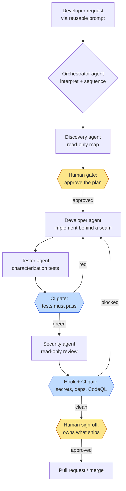

A team I worked with watched a demo where someone typed one sentence — "add rate limiting to the orders API" — and five agents lit up, one after another, planning, coding, testing, reviewing, and opening a pull request while the presenter sipped coffee. It looked like the future. So they went back and wired up their own five-agent "autonomous dev team" on a fifteen-year-old billing system. By the second week they had confident chaos. The developer agent edited a file the architecture agent had just flagged as frozen. The tester agent wrote tests against behaviour the developer agent had already changed. A config change shipped to a branch because the workflow "completed" and nobody, human or agent, was actually accountable for the decision. Everything ran. Nothing was owned.

Here is the lesson that took them a month to accept, and that I want to save you: the fix was not more autonomy. It was better orchestration design. The seductive demo hides the fact that the hard part of a multi-agent system is not making agents do work, it is deciding who does what, in what order, with which tools, and where a human puts their name on the outcome.

So this finale is the honest one. This is the piece where I tell you what a **GitHub Copilot multi-agent** setup genuinely buys you, what Copilot really orchestrates today versus what is an architectural pattern you assemble and drive yourself, and how to design a **Copilot orchestrator** that a real legacy team can run without pretending a robot took the wheel.

This is Part 5, the finale of the legacy-modernization thread in my Copilot series, and the capstone of the whole arc. It assumes you have followed along. Part 1 gave the [blueprint for Copilot agents on legacy applications](../github-copilot-agents-for-legacy-applications). Then we drilled into each role: [understanding a legacy codebase with a discovery agent](../github-copilot-understand-legacy-codebase-discovery) in Part 2, [changing legacy code safely with characterization tests](../safely-change-legacy-code-github-copilot-characterization-tests) in Part 3, and [building a security agent that helps without lying to you](../github-copilot-security-agent-legacy-systems) in Part 4. This part is the drill-down on the orchestration design itself: how the orchestrator, the role agents, and the reusable prompts fit together as a repeatable pattern.

> One caveat up front, and I mean it more here than anywhere in the series. Copilot's agent, handoff, Skills, and hook features move between preview and general availability, and exact paths, frontmatter keys, and platform support change month to month. Everything below matches current GitHub docs at the time of writing. Custom agent handoffs, in particular, are an IDE-side feature today and are not supported for the Copilot cloud agent on GitHub.com. Features evolve — confirm against the current GitHub documentation before you rely on any specific behaviour.

## What "multi-agent" really buys you

Let me reframe the whole idea before we design anything, because the word "multi-agent" is doing a lot of dishonest marketing work in 2026.

A multi-agent Copilot setup is separation of concerns for AI. That is the honest one-line definition. It is the same instinct that made you split a monolith into services: not because the parts became sentient, but because a smaller piece with a narrow job and a narrow blast radius is easier to reason about, review, and trust.

Think about why one giant agent fails on a legacy system. You hand it "modernise this module" and it has to hold everything in its head at once — the business rules, the test strategy, the security posture, the architecture constraints — inside one context window. It drifts. It half-remembers a rule you gave it four steps ago. It is a junior who is simultaneously the developer, the QA, the security reviewer, and the architect, and does none of them well.

Now split that. A developer agent that only writes code behind a seam. A tester agent that only characterises and verifies behaviour. A security agent that only reviews, read-only, and never edits. An architecture agent that only reasons about boundaries. Each has a narrow charter, narrow tools, and a smaller context to keep straight. In short: the value is role clarity, a smaller blast radius per agent, and seams you can actually review — not emergent intelligence.

That reframe matters because it tells you what to optimise. You are not trying to make the agents smarter. You are trying to make the seams between them cleaner.

## The Copilot orchestrator pattern, designed properly

The orchestrator is the agent everyone imagines as the "manager AI." Its real job is narrower and more useful than that fantasy.

A good orchestrator agent does four things: it interprets the request in plain language, it picks the right specialist agent or agents for the job, it sequences the work into phases, and, this is the part people skip, it surfaces decisions back to a human at the points that matter. It is a router and a sequencer, not a boss that fires and forgets.

Here is a main orchestrator agent as an `.agent.md` file in `.github/agents/`. Notice it can edit nothing itself. It reads, it plans, and it hands off.

```markdown
---
name: orchestrator
description: >
  Routes a legacy-modernization request to the right specialist agent and
  sequences the work into reviewable phases. Plans and delegates; never edits
  code or ships. Always surfaces a decision point to a human before and after
  the implementation phase.
tools: ['search', 'read', 'githubRepo']
handoffs:
  - label: 'Discover the code first'
    agent: discovery
    prompt: 'Map the module named in the request and report entry points, side effects, and hidden dependencies before any change.'
    send: false
  - label: 'Implement behind a seam'
    agent: developer
    prompt: 'Implement the approved plan behind a seam. Do not modify behaviour outside the named module.'
    send: false
  - label: 'Characterize and verify'
    agent: tester
    prompt: 'Write characterization tests that pin current behaviour, then verify the change did not alter it.'
    send: false
  - label: 'Security review (read-only)'
    agent: security
    prompt: 'Review the diff for injection, authz, and secret exposure. Advisory only. Flag, do not fix.'
    send: false
---

You are the orchestrator for legacy-modernization work. You do not write or
edit code. Your job:

1. Restate the request and the module in scope in one sentence.
2. Propose a phase sequence: discover -> plan -> implement -> characterize -> secure -> human sign-off.
3. Name which specialist owns each phase and why.
4. Stop and hand off. After each phase returns, summarise what changed and
   ask the human to approve moving to the next phase.

Rules:
- Never skip the characterization phase before a change to untested code.
- Never proceed to implementation without an explicit human "go".
- If two specialists disagree, present both positions and ask the human to decide.
```

Read the `send: false` on every handoff. That single flag is the honesty of the whole design. It means the orchestrator pre-fills the prompt for the next agent, but a human reviews and sends it. The switch between phases is a decision, and a person makes it.

### Handoffs, honestly

This is where I have to be precise, because "handoff" sounds more autonomous than it is.

In an agent's frontmatter, a `handoffs` entry has a `label` (the button text), an `agent` (the target), an optional `prompt` (pre-filled for the target), and a `send` flag. When you pick a handoff, you switch to the target agent and your conversation context carries over. With `send: false`, the prompt sits in the target's input waiting for you to read it and hit enter. That is it.

So a handoff is a guided context switch with memory, not a message one agent autonomously fires at another that then runs off and ships. And there is a bigger asterisk: handoffs are supported in the IDE-side custom agents today and are not supported for the Copilot cloud agent on GitHub.com. Where your neat org chart shows an arrow between two agents, the real hand-off gate in production is often a human clicking, a hook running, or a CI check passing. The arrows are you.

Say it plainly: the org chart is a design, and the human, the hooks, and CI are the glue that hold it together.

### The orchestration, drawn with its real gates

Here is the pattern as I actually draw it for a team. Note that it is not a closed autonomous loop. Every phase boundary has a human or a CI gate, on purpose.



The yellow boxes are humans. The blue boxes are deterministic gates: hooks and CI. The agents advise and act inside their lane; the gates are where the flow is allowed to move forward. That is the whole architecture in one picture: AI does the specialised labour, deterministic checks enforce, and humans own the decisions.

## Designing clean role boundaries

This is the engineering meat, and it is where most of the payoff lives. Give every agent three things: a narrow charter, least-privilege tools, and a shared source of truth.

The tools frontmatter is your least-privilege control. If you omit `tools`, the agent gets access to everything available, which is exactly the god-agent problem you were trying to escape. So be deliberate. The security and architecture agents get read and search only. The tester agent can run tests. Only the developer agent can edit files. That single rule, only one agent can write, removes a whole class of the "agents stepping on each other" chaos that started this article.

The shared source of truth is your repository instructions plus your Skills. Every agent reads the same standards, so they do not contradict each other about naming, error handling, or what "done" means. If you have not set those up, my [custom instructions post](../github-copilot-custom-instructions) and the [Skills explainer](../github-copilot-skills-deep-dive) are the foundation this section assumes.

Here is the role map I hand a team. Print it and stick it on the wall.

| Agent | Responsibility | Tools (least-privilege) | Must NOT do | Hands off to |
|---|---|---|---|---|
| Orchestrator | Interpret, sequence, surface decisions | read, search | Edit code; skip a human gate | Discovery, then specialists |
| Discovery | Map the module, find hidden side effects | read, search | Change anything; guess silently | Human (approve plan) |
| Developer | Implement the approved plan behind a seam | read, edit, run tests | Touch code outside scope; ship untested | Tester |
| Tester | Characterize behaviour, verify no drift | read, run tests | Edit production code; approve its own change | CI gate, then Security |
| Security | Advisory review for authz, injection, secrets | read, search | Fix code; act as the sign-off | Hook + CI gate, then human |
| Architecture | Reason about boundaries and blast radius | read, search | Implement; block without stating trade-offs | Human (decide) |

Look at the "Must NOT do" column. That is the column that saves you. A role is defined as much by what it is forbidden to do as by its job. The tester that cannot approve its own change. The security agent that cannot fix and cannot sign off. These negative constraints are what stop the confident chaos.

## Reusable prompts as the interface

If the agents are the workers, the reusable prompts are the control panel a human uses to drive them predictably. The New Feature, Bug Fix, and Code Review prompts from Part 1 are how you start the orchestra the same way every time, instead of typing a fresh vague sentence and hoping.

Here is a refined orchestration prompt that names the whole sequence and ties Parts 2, 3, and 4 together into one drive. Store it as a reusable prompt file so anyone on the team runs the same pattern.

```markdown
# Orchestrate: safe legacy change

Run this as the orchestrator agent.

Request: <one sentence — what to change and in which module>

Sequence, and STOP for my approval at each gate:

1. **Analyze existing.** Hand off to discovery. Report entry points, side
   effects, and hidden dependencies. Do not propose a change yet.
   -> STOP. I approve the map.
2. **Plan.** Propose the smallest change behind a seam so behaviour is
   preserved. Name the seam. List what stays frozen.
   -> STOP. I approve the plan.
3. **Implement.** Hand off to developer. Change only the named module,
   behind the seam. No behaviour changes outside scope.
4. **Characterize.** Hand off to tester. Pin current behaviour first, then
   verify the change did not move it. Tests must pass in CI.
   -> CI gate.
5. **Security review.** Hand off to security, read-only. Flag authz,
   injection, and secret risks. Advisory only.
   -> Hook + CI gate: secrets, deps, CodeQL.
6. **Human sign-off.** Summarise the diff, the tests added, and the security
   findings. I decide whether it ships.

If any specialist contradicts another, present both and ask me to decide.
```

Notice the prompt itself encodes the honesty. The word STOP appears three times. The human is written into the workflow, not bolted on after. A good orchestration prompt is a script for the humans as much as the agents.

## Deterministic glue between the agents

Here is where the whole series ties into one knot. The seams between agents — the boundaries where one phase ends and the next begins — are exactly where Hooks and required CI checks live. Agents advise and act; hooks and CI enforce; humans decide. That sentence is the spine of everything I have written across these five parts.

Copilot Hooks are JSON files in `.github/hooks/`. The structure is a `version` of `1` and a `hooks` object with lifecycle events — `sessionStart`, `preToolUse`, `postToolUse`, `agentStop`, `errorOccurred`, and more. A `preToolUse` hook can inspect what an agent is about to do and deny it. That is your deterministic gate between phases, and unlike an agent's judgement, it runs the same way every single time. My [hooks for beginners post](../github-copilot-hooks-for-beginners) walks the basics; here is a seam that blocks a commit if a secret shows up before the security phase even runs.

```json
{
  "version": 1,
  "hooks": {
    "preToolUse": [
      {
        "match": { "tool": "bash" },
        "run": {
          "bash": ".github/hooks/scripts/guard-commit.sh",
          "powershell": ".github/hooks/scripts/guard-commit.ps1"
        }
      }
    ],
    "sessionEnd": [
      {
        "run": {
          "bash": ".github/hooks/scripts/audit-session.sh",
          "powershell": ".github/hooks/scripts/audit-session.ps1"
        }
      }
    ]
  }
}
```

The `preToolUse` hook here fires before any bash tool call. Point `guard-commit.sh` at a secret scan and a dependency check, exit non-zero, and the agent is denied, no matter how confidently it wanted to proceed. The `sessionEnd` hook logs the whole session for audit, so when someone asks "which agent touched this and why", you have a record. A common mistake is to put this logic inside a Skill and call it enforcement. It is not. A Skill shapes advice; a hook and a required CI check are what actually block. That distinction is the same one I made about security in Part 4 and about review in the [code-review-limits post](../github-copilot-automate-code-review-limits) — advisory AI plus enforceable gates.

For the real wall, wire branch protection: tests as a required check (this is where Part 3's characterization tests earn their keep), CodeQL and Dependabot as required checks (Part 4), and a human review required before merge. The hooks catch problems locally and early. Branch protection catches them at the door. Neither is an agent, and that is the point.

## Running it on a real legacy team

Now the adoption reality, because a beautiful design that no team adopts is just a diagram.

Start with one agent. Not five. I know the diagram shows six roles, and I know that is tempting to build in a weekend. Resist it. Pick the single highest-value role — on a legacy system that is almost always the discovery agent, because understanding the code is the bottleneck for everything else. Prove it earns its keep. Then add a second role only when a real need shows up and someone will own it.

Measure which agents actually get used. This surprised the team from my opening story: once they instrumented it, two of their five agents had never been invoked in a month. Those were not agents. They were maintenance debt with a personality. Delete agents nobody uses.

Every agent, Skill, and hook needs an owner, a human whose job is to keep it current. An unowned agent rots. Its instructions drift from reality, it gives stale advice, and one day it confidently recommends a pattern you abandoned a year ago. Ownership is not bureaucracy here; it is the difference between a living tool and a trap.

Keep the org chart small. Here are the failure modes I have watched teams walk into, so you can name them early:

- **Too many agents.** More roles than the team can own or remember. The cure is deletion, not documentation.
- **Unclear ownership.** No human accountable for an agent's advice, so nobody notices when it goes stale.
- **Autonomy theatre.** A workflow that looks self-driving but is really a human clicking "approve" without reading. Worse than manual, because it launders a lack of thought into the appearance of process.
- **Agents contradicting each other.** Two roles with overlapping charters and no shared source of truth. Fixed with narrower roles and shared instructions.
- **No human accountability gate.** The billing config that shipped because the workflow "completed." If no person's name is on the decision, you have not built a team, you have built a way to avoid blame.

In my experience the teams that succeed treat this like hiring, not like installing software. You would not give a new engineer commit rights to everything on day one and no manager. Do not do it to an agent either.

## Before you implement: an orchestration-design checklist

Copy this into your repo and fill it in before you wire a single agent. If you cannot answer a line, you are not ready to add that role.

```markdown
## Copilot orchestration design checklist

### Roles
- [ ] Each agent has a one-sentence charter and does exactly one job
- [ ] No two agents have overlapping responsibilities
- [ ] We are starting with ONE agent, not five

### Tools (least-privilege)
- [ ] Every agent declares an explicit `tools` list (no blank = all)
- [ ] Only the developer agent can edit files
- [ ] Security and architecture agents are read/search only
- [ ] The tester agent can run tests but cannot edit production code

### Handoffs
- [ ] Handoffs use `send: false` so a human reviews each phase switch
- [ ] We confirmed handoff support for our platform (IDE vs cloud agent)
- [ ] Where handoffs are not supported, a human/hook/CI step is the gate

### Gates (deterministic glue)
- [ ] Characterization tests are a required CI check before the security phase
- [ ] Secret scan + dependency + CodeQL are required checks before merge
- [ ] A preToolUse hook blocks secrets locally
- [ ] A sessionEnd hook logs the session for audit

### Prompts
- [ ] The orchestration is driven by a reusable prompt, not ad-hoc typing
- [ ] The prompt names the sequence and STOPS at every human gate

### Ownership & accountability
- [ ] Every agent/skill/hook has a named human owner
- [ ] A human signs off on what ships — their name is on the decision
- [ ] We measure which agents actually get used and delete the rest
```

## Conclusion: design the seams, not the robot

Here is the architect line I want you to leave with. You are not hiring a robot dev team. You are designing an assembly line where AI does the specialised labour and humans own the decisions and the accountability.

Every seam in that line is a choice. Which agent has which job. Which tools it is trusted with. Where a person reviews before the work moves on. Where a deterministic gate refuses to let a mistake through. Get those seams right and a **Copilot orchestrator** becomes genuinely powerful — faster, more consistent, less error-prone than a room of people doing it by hand. Get seduced by autonomy and you build confident chaos with a nice diagram on top.

The organisation that wins with **multi-agent AI development** is not the one that automates the most. It is the one that designs the cleanest seams between human judgement and machine speed.

That is the whole legacy journey this series has walked. Understand the system (Part 2). Change it safely (Part 3). Secure it honestly (Part 4). And now orchestrate it (Part 5) — not by handing over the wheel, but by designing where the wheel lives and whose hands stay on it. Build the agents. Keep the gates. Let the humans own what ships.

Start with one agent on Monday. Add the second only when the first has earned it. That is how you build an AI development team that is honest about what it is, and better for it.

Sources: [Custom agents configuration — GitHub Docs](https://docs.github.com/en/copilot/reference/custom-agents-configuration), [About custom agents — GitHub Docs](https://docs.github.com/en/copilot/concepts/agents/cloud-agent/about-custom-agents), [Using hooks with GitHub Copilot agents — GitHub Docs](https://docs.github.com/en/copilot/how-tos/copilot-on-github/customize-copilot/customize-cloud-agent/use-hooks), [GitHub Copilot hooks reference — GitHub Docs](https://docs.github.com/en/copilot/reference/hooks-reference).
