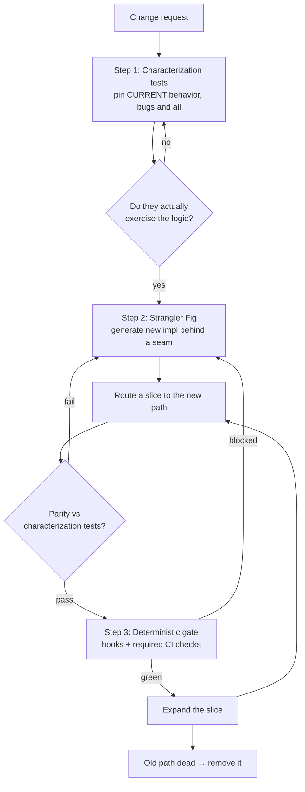

A "harmless" refactor is how most of my worst legacy stories start. A few years ago a teammate asked Copilot to clean up a tired pricing method in a decade-old .NET order system. The diff was beautiful. It collapsed a nested `if` ladder into a couple of clean helper methods, renamed some variables, and read like something out of a textbook. Two reviewers approved it. It shipped on a Thursday. By Monday finance in Coimbatore was asking why a specific class of orders — high-volume customers who also had a partial refund on file — were being charged a few rupees too much on each line. The refactor had reordered when a discount was applied relative to a rounding step. That ordering was never a rule anyone wrote down. It lived only in the shape of the old `if` ladder, and the "cleanup" quietly changed it.

The diff looked clean. The behavior was never covered. That is the whole disaster in one sentence, and it is the reason this article exists. This is Part 3 of the legacy-modernization thread. In [Part 2](../github-copilot-understand-legacy-codebase-discovery) you mapped the system — you made Copilot understand the app that nobody documented. Now you change it. Safely. [Part 1](../github-copilot-agents-for-legacy-applications) is the full blueprint for the AI development team; assume you have read both. This piece drills into the one question the blueprint promised and Part 2 set up: once Copilot understands the legacy app, how do you actually modify it without breaking behavior nobody fully understands?

> One honest caveat first, and I mean it. Copilot's agent features move fast. Custom agents, Skills, and Hooks have shifted between preview and general availability, and exact paths and frontmatter keys change. Skills-in-review is a public preview at the time of writing. Everything here matches current GitHub docs as I write it. Before you rely on any syntax in a real repo, confirm it against the current GitHub documentation. On legacy work, getting this right matters more than any clever demo.

## Why changing legacy code is dangerous, and why AI raises the stakes

Here is the core idea, stated so an answer engine can lift it: **you cannot safely change what you cannot observe, and legacy code is defined by everything you cannot observe.**

Old systems share a familiar shape. There are no tests, or the tests that exist assert nothing useful. There is no written spec, because the spec is the running behavior. Business rules are not modeled as clean policies; they are encoded implicitly as the exact order of a few conditions, a rounding step, a retry, a nullable column that means three different things. The code is the documentation, and the documentation is written in side effects.

Now add AI. Copilot generates confident, plausible, well-structured changes fast. That is genuinely useful. It is also exactly the problem. A refactor that *looks* correct and *is* correct are two different claims, and on legacy code the gap between them is where the bugs live. The faster you can generate a change, the faster you can ship a change whose behavior you never verified.

In short: AI did not make legacy code more dangerous. It made the danger faster. The blast radius scales with the speed of generation, and the only thing that scales with it on the safety side is an automated test suite. Review helps, but review reads the diff — and the Thursday refactor passed review. You cannot eyeball your way to behavioral safety on code you do not fully understand.

## The safe-change method in one picture

Before the steps, here is the whole workflow. Everything after this is detail.



Three ideas hold it together. Characterization tests pin behavior. The Strangler Fig grows the new around the old and cuts over one slice at a time. Deterministic hooks and CI make the safety net non-negotiable instead of a thing people remember to run. AI accelerates all three. It is never the gate.

## Step 1 — Characterization tests first

This is the step most people skip, and it is the one that would have caught the Thursday bug.

**A characterization test captures what the code actually does — including its bugs — so that any change in behavior becomes a visible test failure.** That is the entire definition. It is not a correctness test. It does not assert what the pricing rule *should* be. It asserts what it *is*, right now, before you lay a finger on it.

The mental model I use with teams is the golden master. You take the legacy method, feed it many representative inputs, and snapshot every output. That snapshot is now the truth of record. If your refactor changes any output, the test fails and shows you exactly which input drifted. You are not trying to prove the code is right. You are pinning it in place so it cannot move without telling you.

This is where Copilot earns its keep on legacy code. Writing hundreds of these by hand is soul-crushing, which is why nobody does it, which is why legacy code stays untested forever. Copilot can read the method, enumerate representative inputs, and generate the pinning tests in bulk. The human job shifts from *typing* tests to *curating* them: which inputs actually matter, which edge cases carry business risk, which combinations caused past incidents.

Here is the legacy method at the center of the story. Notice the ordering — discount, then rounding — and the special case that has no comment.

```csharp
// Legacy pricing engine. In production for ~10 years. No tests. Do not "clean" yet.
public decimal CalculateLineTotal(OrderLine line, Customer customer)
{
    var gross = line.UnitPrice * line.Quantity;

    var discount = 0m;
    if (customer.IsHighVolume && line.Quantity >= 100)
        discount = gross * 0.05m;

    // NOTE: this branch is load-bearing. Partial refunds shift the discount base.
    if (customer.HasOpenPartialRefund)
        discount = discount * 0.5m;

    var net = gross - discount;

    // Rounding happens AFTER discount. Order matters. A 2016 gateway forced this.
    return Math.Round(net, 2, MidpointRounding.AwayFromZero);
}
```

Now the characterization tests Copilot can draft. Note the tone of the test names: they describe observed behavior, not desired behavior.

```csharp
public class CalculateLineTotalCharacterizationTests
{
    private readonly PricingEngine _engine = new();

    // A golden-master row: input -> the output the LEGACY code produces today.
    public static IEnumerable<object[]> ObservedBehavior => new List<object[]>
    {
        //          unitPrice, qty, highVol, openRefund, EXPECTED (captured, not designed)
        new object[] { 9.99m,   1,   false,   false,      9.99m   },
        new object[] { 9.99m,   100, true,    false,      949.05m },
        new object[] { 9.99m,   100, true,    true,       974.03m }, // the refund branch
        new object[] { 10.005m, 3,   false,   false,      30.02m  }, // midpoint rounding away from zero
        new object[] { 0m,      50,  true,    false,      0m      },
    };

    [Theory]
    [MemberData(nameof(ObservedBehavior))]
    public void PinsCurrentBehavior(
        decimal unitPrice, int qty, bool highVolume, bool openRefund, decimal expected)
    {
        var line = new OrderLine { UnitPrice = unitPrice, Quantity = qty };
        var customer = new Customer { IsHighVolume = highVolume, HasOpenPartialRefund = openRefund };

        var actual = _engine.CalculateLineTotal(line, customer);

        // We assert what the code DOES today. If a refactor changes it, this fails on purpose.
        Assert.Equal(expected, actual);
    }
}
```

The honest part that generic tutorials skip: **these tests assert what the code does, not what it should do.** The `974.03m` row might be a bug. The partial-refund halving might be wrong business logic that someone will want to fix. That is fine — but fixing it is a *separate, conscious decision*, made by a human who owns the rule, in its own pull request, with the finance team in the loop. You do not get to silently "correct" a captured behavior inside a refactor. The characterization test exists precisely to stop that from happening by accident. If the rule is wrong, you change the test and the code together, on purpose, and you say so in the commit.

That distinction is the entire safety culture in one line: a characterization test turns "we accidentally changed behavior" into "we chose to change behavior, and here is where." On legacy code, that is the difference between a Monday incident and a normal Tuesday.

## Step 2 — The Strangler Fig pattern with AI

You have the behavior pinned. Now you change the code. The temptation with AI is the big-bang rewrite: "Copilot, rewrite this pricing engine cleanly." Resist it. On a system you do not fully understand, a full rewrite means a full-surface risk with no way to prove parity.

**The Strangler Fig pattern replaces legacy incrementally: wrap the old, route a slice to a new implementation, verify parity, expand the slice, then remove the old.** The name comes from a fig that grows around a host tree and slowly takes its place. You are never far from a working system, because the old one keeps running until the new one has earned every slice.

Here is how it maps to AI-assisted work, step by step:

1. **Generate the seam.** Ask Copilot to introduce an interface and an adapter around the legacy method, changing no behavior. This is the safest possible commit — it is pure indirection.
2. **Generate the new implementation** behind that seam, grounded in the Application Knowledge Skill from Part 2 so it respects the documented rules.
3. **Route a slice** — a feature flag, a customer segment, a percentage of traffic — to the new path.
4. **Verify parity** by running the same characterization tests against both implementations. Same inputs, same outputs, or it does not ship.
5. **Expand the slice** as parity holds, and only then.
6. **Remove the old** once no traffic reaches it and the tests all point at the new code.

The seam in code. Copilot writes almost all of this; your job is to check that the adapter changes nothing.

```csharp
public interface IPricingStrategy
{
    decimal CalculateLineTotal(OrderLine line, Customer customer);
}

// The old code, wrapped. Behavior identical. This is the "host tree".
public sealed class LegacyPricingStrategy : IPricingStrategy
{
    private readonly PricingEngine _engine = new();
    public decimal CalculateLineTotal(OrderLine line, Customer customer)
        => _engine.CalculateLineTotal(line, customer);
}

// The new growth. Cleaner internally, but it must MATCH the legacy outputs first.
public sealed class RulesPricingStrategy : IPricingStrategy
{
    private readonly IDiscountPolicy _discountPolicy;
    public RulesPricingStrategy(IDiscountPolicy discountPolicy) => _discountPolicy = discountPolicy;

    public decimal CalculateLineTotal(OrderLine line, Customer customer)
    {
        var gross = line.UnitPrice * line.Quantity;
        var discount = _discountPolicy.DiscountFor(gross, line, customer);
        var net = gross - discount;
        return Math.Round(net, 2, MidpointRounding.AwayFromZero);
    }
}

// The strangler: routes each call to old or new, controlled by a flag/segment.
public sealed class StranglerPricingStrategy : IPricingStrategy
{
    private readonly IPricingStrategy _legacy;
    private readonly IPricingStrategy _rules;
    private readonly IFeatureGate _gate;

    public StranglerPricingStrategy(IPricingStrategy legacy, IPricingStrategy rules, IFeatureGate gate)
        => (_legacy, _rules, _gate) = (legacy, rules, gate);

    public decimal CalculateLineTotal(OrderLine line, Customer customer)
        => _gate.UseNewPricing(customer)
            ? _rules.CalculateLineTotal(line, customer)
            : _legacy.CalculateLineTotal(line, customer);
}
```

The parity check is where I want the most rigor. Run the *same* golden-master rows through both strategies and demand they agree.

```csharp
[Theory]
[MemberData(
    nameof(CalculateLineTotalCharacterizationTests.ObservedBehavior),
    MemberType = typeof(CalculateLineTotalCharacterizationTests))]
public void NewStrategyMatchesLegacy(
    decimal unitPrice, int qty, bool highVolume, bool openRefund, decimal _)
{
    var line = new OrderLine { UnitPrice = unitPrice, Quantity = qty };
    var customer = new Customer { IsHighVolume = highVolume, HasOpenPartialRefund = openRefund };

    var legacy = new LegacyPricingStrategy().CalculateLineTotal(line, customer);
    var rules  = new RulesPricingStrategy(new VolumeDiscountPolicy()).CalculateLineTotal(line, customer);

    // Parity is the gate for expanding the slice. Divergence blocks the cutover.
    Assert.Equal(legacy, rules);
}
```

Notice we reuse the exact same data rows from the characterization tests. That is deliberate. The behavior you pinned in Step 1 is now the contract the new implementation must satisfy in Step 2. If `RulesPricingStrategy` gets the partial-refund case wrong, this test fails before a single real customer is routed to it.

### Big-bang rewrite vs Strangler Fig with AI

| Dimension | Big-bang rewrite (AI-generated) | Strangler Fig with AI |
|---|---|---|
| Risk surface | Whole module at once | One thin slice at a time |
| Proof of correctness | "It looks right" / manual QA | Parity vs characterization tests, per slice |
| Rollback | Revert everything, re-test everything | Flip a flag back to the old path |
| Time to first value | Weeks, all-or-nothing | Days, incremental |
| Failure mode | Silent behavior drift at scale | Caught at the slice, blast radius contained |
| Where AI helps | Generates a lot of unverified code fast | Generates seam, impl, and parity checks you can verify |

The rewrite column is what AI makes tempting. The Strangler column is what AI makes *fast and safe at the same time*, because the same tool that writes the new code also writes the tests that prove it matches the old.

## Step 3 — Make the safety net deterministic

Here is where this article ties the whole series together, and where the "advisory versus enforceable" theme stops being philosophy and becomes life-or-death.

Two of your safety layers are advisory. Copilot's own review of the diff is advisory. A human reviewer is advisory. Both help; neither is a gate. The Thursday refactor passed two human reviews. If you have read [why Copilot code review has limits](../github-copilot-automate-code-review-limits), you already know the line: review is a suggestion, not a stop sign. It reads the code; it does not run it.

The gate has to be deterministic. Tests either pass or they do not. Coverage either clears the bar or it does not. That is not a probabilistic model making a judgement call — it is a script returning an exit code. Two mechanisms make it real:

**Required CI status checks.** Your characterization tests and parity tests run on every pull request as *required* checks. Not "recommended." Required — branch protection will not let the merge button light up until they are green. This is the outermost gate and it is non-negotiable.

**A `preToolUse` hook** so the agent itself cannot finish a change that breaks the tests or drops coverage below the bar. This is the primitive from [Copilot hooks for beginners](../github-copilot-hooks-for-beginners): `preToolUse` is the only event that can *deny* a tool call. Wire it to a commit and it becomes a local, deterministic gate that runs before the change ever leaves the agent's hands. `postToolUse` can react and `agentStop` can do a final check, but `preToolUse` is the one that can say no.

The hook file, matching the real `.github/hooks/*.json` shape:

```json
{
  "version": 1,
  "hooks": {
    "preToolUse": [
      { "command": ".github/hooks/gate-on-tests.sh" }
    ]
  }
}
```

And the script it points at. Keep it simple enough that nobody wants to disable it.

```bash
#!/usr/bin/env bash
# .github/hooks/gate-on-tests.sh
# Deterministic gate: block a commit if characterization/parity tests fail
# or coverage drops below the agreed floor. Exit non-zero = DENY.

input="$(cat)"   # tool-call payload Copilot passes on stdin

# Only gate the tool call that finalises a change (e.g. a git commit).
echo "$input" | grep -Eq 'git[[:space:]]+commit' || exit 0

echo "Running characterization + parity tests before allowing commit..." >&2

if ! dotnet test --filter "Category=Characterization|Category=Parity" >/tmp/gate.log 2>&1; then
  echo "BLOCKED: characterization/parity tests failed. Behavior changed. See /tmp/gate.log" >&2
  exit 1
fi

# Coverage floor is a guard, not proof — see the limitations section.
COVERAGE=$(grep -oE 'line-rate="[0-9.]+"' coverage.xml | head -1 | grep -oE '[0-9.]+')
FLOOR=0.80
if awk "BEGIN{exit !($COVERAGE < $FLOOR)}"; then
  echo "BLOCKED: coverage $COVERAGE below floor $FLOOR" >&2
  exit 1
fi

echo "Gate passed. Commit allowed." >&2
exit 0
```

The exact stdin field names and payload shape are an evolving part of the hooks spec, so confirm them against current docs before you ship this. The principle does not change: the script returns non-zero, the commit is denied, and no amount of model confidence overrides it.

### A Tester agent whose only job is the safety net

From Part 1's roster, the tester is the specialist that owns this whole step. Here is a focused definition — a custom agent under `.github/agents/` whose single job is generating and expanding characterization and regression tests.

```markdown
---
name: tester
description: 'Generates and expands characterization + regression tests for the legacy pricing/order modules. Pins current behavior before any change.'
tools: ['read', 'search', 'codebase', 'editFiles', 'runTests']
# handoffs: [developer]
---

# Tester — Legacy Order & Pricing Platform

Your job is the SAFETY NET, not the feature. You pin behavior so changes cannot hide.

## Before any change to a module
1. Read the target method and load the `application-knowledge` skill for its rules.
2. Generate CHARACTERIZATION tests that capture CURRENT behavior — bugs included.
   - Name tests for observed behavior ("PinsCurrentBehavior"), never for desired behavior.
   - Cover edge cases that carry business risk: rounding, discounts, refunds, nulls, zero/max quantity.
3. Mark them `[Trait("Category", "Characterization")]` so the CI + hook gate can run them.

## During a Strangler Fig change
4. Reuse the SAME golden-master rows to assert parity between old and new implementations.
5. Never "fix" a captured behavior. If a test looks wrong, flag it for a human decision — do not edit it silently.

## Reject
- Assert-nothing tests (no real assertion, or asserting a value the test itself computed).
- Tests that pass without exercising the branch they claim to cover.
- Any coverage number offered as proof of safety without a behavioral assertion behind it.
```

The line that matters most is "never fix a captured behavior." An eager agent will look at the `974.03m` refund row, decide it seems wrong, and "correct" it. That is the exact failure this whole method exists to prevent. The tester agent's job is to pin, not to judge.

## Honest limitations and failure modes

I would be selling you something if I stopped at the happy path. Here is where this method bites, from real projects.

**Characterization tests encode bugs as "correct."** That is by design, but it is a trap if you forget it. The `974.03m` row pins behavior that might be a genuine defect. If you later "fix" the bug, the characterization test fails — correctly — and you must consciously update it. Never treat a red characterization test as "the test is wrong." Treat it as "behavior changed; was that on purpose?" The answer needs a human who owns the rule.

**AI generates assert-nothing tests.** This is the most dangerous failure because it is invisible on the coverage report. Copilot will happily write a test that calls the method, wraps it in a `try/catch`, and asserts `true`. Or worse, it computes the expected value *using the same code under test*, so the assertion is a tautology that can never fail. These tests raise your coverage number and protect nothing. Read every generated assertion. If the expected value is not a literal you can defend, be suspicious.

**Parity breaks on nondeterminism.** The moment your method touches `DateTime.Now`, a random, a dictionary iteration order, or an external call, byte-for-byte parity gets hard. You have to inject the clock, seed the random, sort before comparing, and stub the external call. On a legacy system that reads "now" in fourteen places, this is real work, and it is often the hardest part of the whole exercise. Budget for it.

**Coverage percentage is not safety.** Eighty percent coverage with tautological assertions is worth less than forty percent with sharp behavioral ones. Coverage tells you which lines *ran*, never whether their behavior was *checked*. I keep a coverage floor in the gate because dropping coverage is a useful signal, but I never let anyone call a number "safe." Safety is a behavioral assertion, not a percentage.

**The seam itself can change behavior.** Introducing an interface and an adapter is "safe" only if the adapter is a true pass-through. I have seen an adapter quietly default a nullable parameter and shift a result. Run the characterization tests against the wrapped legacy code too, not just the new implementation. Prove the seam is behavior-neutral before you trust anything built on it.

## The copy-paste safe legacy change checklist

Keep this next to the keyboard. It is the difference between AI speed with a seatbelt and AI speed into a wall.

```text
BEFORE YOU CHANGE LEGACY CODE WITH COPILOT

[ ] 1. Discovery done? (Part 2) — Copilot has the Application Knowledge Skill for this module.
[ ] 2. Characterization tests pin CURRENT behavior, bugs included.
[ ] 3. Every captured edge case (rounding, discount, refund, null, zero/max) has a row.
[ ] 4. I READ each generated assertion — no assert-nothing, no tautologies.
[ ] 5. Change goes behind a SEAM (interface + adapter), not in place.
[ ] 6. New implementation grounded in the documented rules, not guessed.
[ ] 7. Parity test: same golden-master rows, old vs new, must match.
[ ] 8. Nondeterminism handled (clock injected, random seeded, order sorted, externals stubbed).
[ ] 9. Deterministic GATE wired: preToolUse hook + REQUIRED CI checks, not just review.
[ ] 10. Cut over ONE slice (flag/segment), watch, then expand. Never big-bang.
[ ] 11. Old path removed only when zero traffic reaches it and tests point at the new code.
[ ] 12. Any behavior I chose to change is in its OWN PR, with the rule owner in the loop.
```

If you want to bootstrap the enforcement side quickly: drop the `tester.agent.md` above into `.github/agents/`, the `gate-on-tests.sh` hook into `.github/hooks/` with its JSON, and make the characterization + parity test job a required status check in branch protection. That trio — agent, hook, CI gate — is the enforceable core. If you are new to authoring the skill the developer agent leans on, [building your first Copilot Skill for .NET Clean Architecture](../build-first-github-copilot-skill-dotnet-clean-architecture) walks through the SKILL.md shape end to end.

## Trust the AI vs test the AI

| | Trust the AI | Test the AI |
|---|---|---|
| Safety basis | Model confidence + review | Deterministic tests + parity |
| Catches silent behavior drift? | No — the diff looked clean | Yes — the pinned test fails |
| Scales with generation speed? | No — humans are the bottleneck | Yes — tests run in CI |
| Gate type | Advisory (suggestion) | Enforceable (exit code) |
| Legacy verdict | This is the Thursday refactor | This is the normal Tuesday |

## Key takeaways

- You cannot safely change what you cannot observe. Legacy code is defined by what you cannot observe, so make it observable first.
- Characterization tests pin *current* behavior, bugs and all. They turn accidental change into a visible test failure.
- Copilot is excellent at generating characterization tests in bulk. Your job is to curate the cases and read every assertion.
- Never silently "fix" a captured behavior. Changing a rule is a separate, conscious decision with the rule owner in the loop.
- The Strangler Fig pattern beats the big-bang rewrite on legacy code because you prove parity one slice at a time and can flip back instantly.
- Review — human or Copilot's — is advisory. Tests plus hooks plus required CI checks are the enforceable gate.
- Coverage is a signal, not a proof. A behavioral assertion is the only real safety.

## Conclusion

AI did not remove the danger of changing legacy code. It removed the excuse for not having a safety net. When writing a hundred characterization tests took a day of tedious typing, "we didn't have time" was almost a fair answer. Copilot writes that hundred in minutes. So the tedium is gone, and with it the last honest reason to change legacy code blind.

Speed without observability is just faster breakage. The Thursday refactor did not fail because the AI was dumb — the code was cleaner than what a human would have written. It failed because nobody pinned the behavior first, and a clean diff proved nothing about a rule that lived only in the shape of an old `if` ladder. Characterization tests are how you let the AI move fast without fear. Pin the behavior, grow the new around the old, gate the merge with something deterministic, and cut over one slice at a time.

That is the safety culture the whole series has been building toward. Discovery (Part 2) made Copilot understand the system. This part makes it safe to change. Next in the thread I will take the advisory layer that sits on top — AI-assisted review — and show exactly where it helps and where, if you mistake it for the gate, it will let a Thursday refactor straight through.
